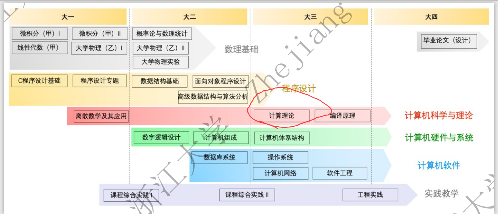

# 本文档是什么？
笔者转专业踩过的坑和对后辈的建议，真心想建立起ZJU内部良好的传帮带氛围。

# 观念&习惯问题
在具体建议前首先回答一些常有的担忧+做一些习惯方面的提醒
### 我能转到CS吗？
能。有如下案例（不代表所有人愿意被联系到，不保证提供联系方式）
- 16级 +CS双学位→清华人工智能研究所CV方向 硕士生或PhD
- 16级 +本校CS方向科研→北美一所top20校（具体不知） PhD
- 16级 +CS双学位→ZJU本校CV方向PhD→在UCSD交换
- 16级 +CS辅修→CMU LTI ms→UCSD NLP方向PhD
- 17级 +曼大语言学双学位→NWU CompLing方向PhD
- 17级 +CS双学位→本科毕业找到工作
你的前辈很多也很成功，所以你也能。

### NLP不是不要语言学同学吗？
- 首先，从你决定转专业的一刻起就要把自己看成CS人。
- 其次，NLP中有数个领域仍需要扎实的语言学功底（在下方科研章节详细介绍）。在ChatGPT问世后NLP的研究方式大转变，我相信多专业背景在这种时候是一种优势，总能为领域带来新的idea。只是读者应当把本专业的知识也学好，在面对CS专业的NLP研究者时你对他们而言的角色应至少是一个语言学专家。
- 跟国外（主要是北美）的语言学人标齐，北美的语言学学生都要做大量实验写大量代码的，语言学是理科。Stanford的自然语言处理本科课程同时开在CS和Ling的课号下。北美NLP研究者有很多都有CS和Ling双学士学位。

### 明确一个十年到三十年的长远规划，主要是以下几个问题

 | 问题 | 我的回答 |
 | ---------- | ------------ |
 | 我要在哪里生活，国内还是国外？ |  |
 | 我转CS是更多因为喜欢理工科，还是因为喜欢工资？ |  |
 | 我要进工业界，去科技互联网公司工作；还是留在学术界，在高校或研究所工作？ |  |
 | 我要做CS除NLP其它的方向，如系统、网络、安全、CV或纯深度学习理论方向；还是做偏深度学习的NLP方向；还是做偏语言学的NLP方向？ |  |
 | 我有多少经费？ |  |
 | 我多少年内需要转好专业？ |  |

### 规划人生中该做/不该做的事的两个准则
- 想象一个简历
	能在简历上很显眼和一个短语以内能表述的经历，才要努力去刷。
	比如相比于“双专业，是一个zju特有的辅修，不水的，它要求的课比辅修多，例如我修了xxx，我只是没修xxx”和“修了一半CS课一半AI课”，“CS双学位”就更适合出现在简历上。
	
- 做重大决定时，至少咨询20个人的建议，要么咨询了解n个人建议的人（比如相应行业的亲人朋友、学生很多的老师）来抵n个人，总之总和要拿到20个人左右的建议。

### 把自己看成CS人
- 不要把自己看作低人一等，所以CS同学该有的机会和名额你都要争取。一次次给老师发邮件、跑办公室是常有且合理的事，不必想“老师觉得我不够格怎么办？“，要想想”如果这次机会耽误了我自己，以后有别的机会会更不够格“呀
- 不要有“学不懂、进度落后一点没事”这种观念，你应当时刻与同级的CS同学比较进度，争取不要落后。

### CS有老师同学看不起我怎么办？
- 无需以偏概全，大部分CS老师同学是很nice的，如果有不支持你的人也无需计较，时刻想想支持你鼓励你的那些人。
- 做事前提前跟老师同学推销一下自己，根据马太效应，你会得到越来越多正反馈。比如选课前可能有老师质疑你的专业，问你会不会学不懂这门课，你可以在沟通时有意无意向老师提一下之前你已经有哪些成绩和技能，让老师明白哪些地方应该关照你，哪些地方可以放心，这样在老师有意无意的支持下学生也容易学得比预期更好。

### 学不好CS，是不是因为学英语课使我变不聪明了？
不是。
- 理论上是完全可以学好的。NLP圈有很多研究者读过语言学和CS双本科，代表AP有AllenNLP Noah Smitch, Colimbia University Zhou Yu（ZJU的本科）. 读语言学没有耽误他们的脑子，反而是一个很好的idea来源。我感觉有很多天才的案例可以证明人的知识容量和学习能力上限是超出大家想象的，学两个专业这件小事远远在这个上限之下。我永远认为毅力和（对自己人生上限的）想象力比当前能力更有决定作用。
- 实际英语专业去CS双专业容易吃低绩点的原因，往往不是能力智力不足，而是有信息差：生活在文科的散漫环境中难以知道大部分同学的自学进度，和如果某些课程有实践上的坑，没有与大部队一起学习的同学就难以知道怎样灵活应对。所以建议与同学一起学习，参见下一条。

### 要拥有一个或几个同样跨专业学CS的朋友，或直接融入同一级的CS本科生圈子里。如果实在没有，一些其它工科的同学也可以。
同学的用处有：
- 帮助你跟上学习节奏。CS的生活节奏是英语专业的2倍，是理科专业的1.5倍，如果决定转专业是需要主动提高一下生活节奏的，做事积极一点，告别拖延。
- 互相推荐好的自学资料，互相分享笔记和讨论题目，分工整理期末复习资料，期末互相提问，形成自学氛围，节省一些踩坑时间。
- 如果某些课程安排有教学事故，你可以及时知道大部分同学是怎样应对的，及时调整自己的应对措施，防止如果成绩占比突然调整，自己将努力花在了最后占成绩比重很小的地方。

### 要多记笔记
记笔记是费曼学习法的投入产出比最高的实践形式，即既帮助检查理解，笔记又造福后人。你可以秉承开源精神，像前辈一样多将笔记公布造福后人（不过请遵守诚信守则）。非常希望ZJU能逐渐形成较好的传帮带氛围，让后辈也有良好校友资源可享用。

### 我可以以怎样的身份本科毕业？我有哪些可行的出路？
以下这些都是可能做到的，我也分别列出了我认为需要准备的背景。
- 出国ms：绩点，暑研/实习
- 出国直接phd：暑研，paper
- 本校直博：绩点，进本校组，夏令营，paper
- 跨校直博：绩点，对方校夏令营，paper
- 工作：刷题，实习
其中我认为值得注意的还有，具体最好由读者再咨询相应身份的人的建议。本条适用前面所述“20个人建议”准则。

# 课程
### CS必修课
首先要明确一个认知问题：读CS双学位是一个原子性的事务，要么不读，要么按需求读完或辅修或双学位，这两种选择都是投入产出比较高的；投入产出比最低的是读一半（微辅修或双专业）。
该图中除数理基础模块不是双学位必修，其它是必修。

（这个图不知道为什么有个红圈，找不到原图了，批评cyh同学乱画）

选不上CS的课怎么办？
- 最有效：补选+在补选的几天里线下去选课办或给选课办发邮件。李晓老师和张传华老师都很nice，表示自己很想选课，跟老师说明原因。
- 第二有效：如果任课老师在计院话语权较大，请任课老师帮忙跟选课办说，能保证你选上该老师的课。
- 第三有效：选课时与CS的同学商量，做出时间正好的一些课表。可能涉及到“用一些课堵住另一些课”这种复杂操作，所以合作比较划算。

怎么学？
- ZJU课程共享计划 https://github.com/QSCTech/zju-icicles
- 图灵班课程速通计划 https://github.com/ZJU-Turing/TuringCourses
- 一位学长的优质笔记 [咸鱼暄的代码空间！ - 咸鱼暄的代码空间 (xuan-insr.github.io)](https://xuan-insr.github.io/)
- 一位学长的优质笔记 https://github.com/Zhang-Each/CourseNoteOfZJUSE

### AI
AI课一般比CS课好选，但是如果选不上也请遵照上条中的建议。
非必要不选AI课，AI课最大的收获是在简历上作为一个90+课程出现，基本学不到东西（除了NLP课我感觉听课收获挺大的），主要靠自学后卷出大作业。

### 语言学
因为英专培养方案还是要求修大量专业课的，感觉可以尽量把语言学模块多修一点，有些在进组的时候可能还是认可的。
以下课程如果拿了高分值得在简历上一提
- 当代语言学
- 语音学
- 句法学
- 心理语言学
- 语义学
- 语用学
- 语料库语言学

### 数学
对于PhD、找工和国内直博：
可能不需要数学。。。认为最好不要额外选数学课
我至今遇到的老师没有因为我简历上任何数学相关的东西而录我或拒我的，都是只问编程。
CS专业课里的离散数学和计算理论（和可能还有数逻）已经足够培养数学思维。
如果担心数据分析和统计技能，文数里据说应用统计学这门课程比高等数学好使，还有机会的同学可以试一下。

对于ms：
确实有一些项目要求修过一些数学课程，例如刚看到SUTD的ISTD ms要求两学期微积分，一学期线代和一学期概统，这种无疑是比较不友好的项目了。
也有比较友好的项目，北美一些0基础转码项目可参照OpenCSapp，英国的IC和UCL在前年也开了零基础转码项目，不过出路和含金量需要自己衡量，还是建议“咨询20个人”准则。代表dp是18级SJTU英语专业，4段科研或互联网厂NLP产品实习，少量高分数学和编程课程，绩点90+ → IC CS ms

### 绩点
- 如申ms：少选课，修个辅修即可，绩点保持88以上
- 保研直博：绩点和title权衡一下，不过好像是夏令营和提前进组更重要
- 如申phd或工作：争取双学位的title，过程中尽力而为，绩点别太纠结，注重科研/实习

# 科研
### 如何选题？NLP有哪些方向可做？
参照这些顶会都有什么track，下面是最近一期每个track的best paper
- [Best Papers - ACL 2023 (aclweb.org)](https://2023.aclweb.org/program/best_papers/)
- [Best Paper Awards - emnlp 2022 (balhafni.github.io)](https://balhafni.github.io/EMNLP_2022/blog/best-paper-awards/)
- [Transactions of the Association for Computational Linguistics (transacl.org)](https://transacl.org/index.php/tacl)
- [Announcing the NAACL 2022 Best Paper Awards! - NAACL-HLT 2022](https://2022.naacl.org/blog/best-papers/)

特别地，想到NLP里比较纯语言学的主题/方法也有一些，有如下几个
为什么要讲这一块因为担心你在面试的时候会需要向老师证明你的另一部分专业知识也是有用的
一般欧洲的NLP会偏语言学一点
- 实验语音和音系学
- 用语言学知识做数据和数据增强
- AI中的伦理道德问题
- 稀有语言挖掘

### 如何选导？
国外导师：常读每年的顶会有意思论文，并参照[CSRankings: Computer Science Rankings](https://csrankings.org/)，关注学术圈养好号后常刷Twitter
国内校内导师：如果有想询问的导师名单可以邮件问我
选导或者联系PhD的时候如果接到的任务是二作三作往后，很可能是打白工，基本可以拒绝。除非你认为你承担的工作较为重要，老师可以给你推荐信，二作三作的作用可能没有推荐信大。
如果申请PhD，推荐信的力度：你与推荐人的产出很重要+目标PhD导认识的人 > 你与推荐人的产出很重要+目标PhD导不认识的人 > 其它

# 申请
因为保研和找工我确实不懂，这里暂时只写申请了。后续有请共同作者扩展内容的计划，如愿意贡献请联系我。

### Check Point
大一暑假结束时：专心学专业课
大二暑假结束时：进组，学会pytorch，训过一些常用的模型
大三暑假结束时：产出一作或共一论文

### 我要不要找中介？
不要。
原因一：CS的在线免费资料足够使用
原因二：中介的信息更新速度赶不上CS学科的发展速度

### 我申请可以参考哪些资料？
申请MS
- 北美的CS master [Home - Open CS Application](https://opencs.app/)
- 除北美外的其它CS master [Global CS (global-cs-application.github.io)](https://global-cs-application.github.io/)
- 一亩三分地/寄托家园等论坛
- CC98上每一年CS的飞跃手册

申请PhD
- 欧美NLP圈对PhD申请的建议 https://github.com/zhijing-jin/nlp-phd-global-equality
- 了解学科优势学校和导师 [CSRankings: Computer Science Rankings](https://csrankings.org/)
- 注册一个Twitter账号，开始关注NLP圈的PhD和AP，各种申请机会他们都会尽快发布的。比如你可以先从Andrew Ng、Christopher Manning、Geoffrey Hinton这种老教授关注起，然后关注他们的关注这样来搞。
- 关注一亩三分地/CC98/一些微信公众号/知乎的招生信息

### 投递暑研注意事项
流程同申请PhD
已经熟识的导师推荐是最快的；否则就自己海投，投发布过招生广告或主页表明正在招生的老师是最快的。有的时候可以尝试投认识的PhD，因为暑研期间大部分情况还是跟着PhD打工。
如果老师给你的责任比较重，且你有比较好的工作环境，我认为线上线下区别不大。
想去北美就套北美，我觉得最好不要找跳板，有北美的线上暑研也很好，只要是你一作，时长6个月以上，每周汇报进度。

### 投递实习注意事项
需要实习 iff 你打算找工or读完硕士找工，申请学术类ms和PhD的话，实习不强求。

- [🏳️‍🌈 总览 - 咸鱼暄的代码空间 (xuan-insr.github.io)](https://xuan-insr.github.io/interviews/overview/) 找暑期实习和秋招的经验帖
- 

# 关于笔者&联系笔者
笔者估计是从英语专业转NLP规划最不顺、进度最曲折的一个。这份文档不是什么成功经验分享，我并不成功，只是想把我踩过的坑告诉后人，希望少有人重蹈我的覆辙。我觉得我的高中和本科过得太坎坷了，真诚地想帮助学弟学妹，希望你们一切顺利。读者可以以我作为基准，在四年后不能（当然如果早做规划，一直在努力，也不会）比我更差。毕竟一条路走的人多了，后人一定是要越走越顺的。

如有建议或疑问请通过邮件联系我 RuoxiNing@outlook.com。