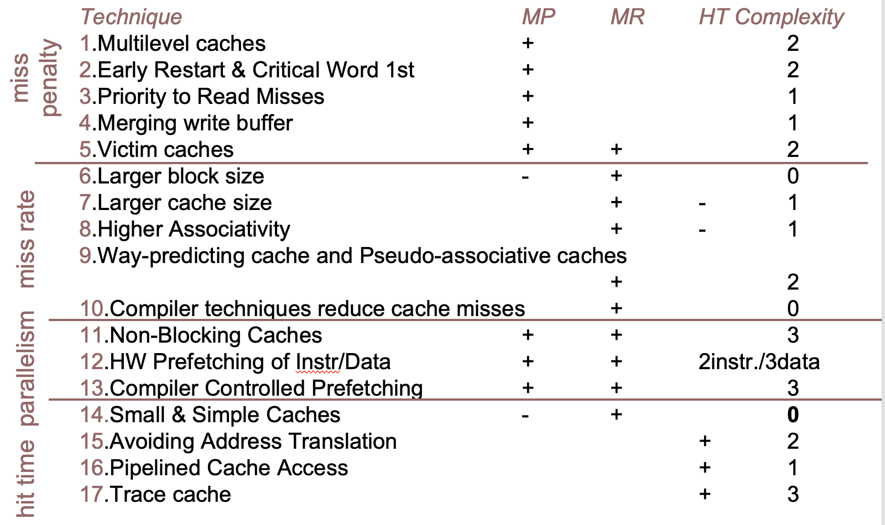

# chap2: Memory Hierachy Design

## 目录
- cache 基础概念（与计组重合）
- cache 优化方法

## cache 基础概念

这块常考大题，比如计算地址长度，计算 AMAT，计算 miss 次数等。 

### cache 的分类和地址的计算方法

!!! warning
    这个表记不清了打算等上计组再补。

| 类别 | 解释 | 标记项结构 | 地址计算 | 优点 | 缺点 |
| -- | -- | -- | -- | -- | -- | 
| direct-mapping 直接映射 |  | | | | |
| fully associative 全关联 |  | | | | | 
| 2^n-set associative 2^n路组关联 |  |  |  |  |  |

- 标记项结构: cache 里的数据和标记项是分成两个（或更多，见王道）存储的，然后标记项因为占用额外的空间所以就是所谓的 overhead

### cache write 的处理方法

| write 策略 | 解释 | 经常搭配的 write-miss 策略 | 解释 |
| -- | -- | -- | -- |
| write through | 每次写数据时既写在cache也写在main memory。好处是cache和main memory总是一致的，但是很慢。可以通过引入一个write buffer来改进。 | write around（也叫non-allocate） | 考虑到既然本来就要去一次main memory，不如直接写在里面，不再拿到cache里了。 |
| write back | 只将修改后的内容放在cache里，该block要被覆盖的时候再写回内存。这种情况需要一个额外的dirty bit来记录这个cache是否被更改过，从而直到被覆盖前是否需要被写回内存。 | write allocate | 像read miss一样先把block拿到cache里再写入 |


### cache miss 的种类 （简称为3C）

| 种类 | 解释 |
| -- | -- |
| compulsory miss | 冷启动失配，刚上电cache是空的，所以不论什么访问都要miss一次。cache越大compulsory miss越多。 | 
| capacity miss | cache块的大小不满足程序局部性时发生的失配，称为容量失配。cache块大小增大，容量失配率减小，与关联度无关。 |
| conflict miss | 在采用组关联和直接映像方式的cache中，主存的很多块都映射到cache的同一块，如果某块本来在cache中，刚被替换出去，又被访问到。有点像 OS 里页替换时讲到的“抖动”。关联度越大，Conflict失配越小。 |


## cache 优化方法

这块常考选择。

总结性的图


接下来具体讲解每一种优化方法。

首先四大类优化的思路是如何产生的？来自于衡量内存性能的公式：

$$ Average\space Memory\_access\space Time\space (AMAT) = Hit\_time + Miss\_rate \times Miss\_penalty $$

首先这个公式的意思是，当 CPU 需要内存访问的时候，访问时间的计算方法是：
- 如果在 cache 里找到了，即发生 cache hit，那么需要的时间只有 cache 的访问用时即hit_time。
- 如果在 cache 里没找到（此时已经用了一个 hit_time，这就是为什么 hit_time 是 100% 要用掉的），那么就需要去内存里找，去内存里找的用时是这种情况所占的百分比 miss_rate 乘上去内存里找一次的耗时 miss_penalty。

!!! note

    当然题目里还可能会说 "cache 和 memory 是同时访问的"，意思就是 cache 和 memory 一起找，如果 cache 里找到了，就把 memory 访问掐掉，这样在 miss 的情况下是比先在 cache 里找完再去 memory 找更快的。这样的条件下计算 AMAT 就需要把 hit_time 乘上一个 hit_rate，不再是 100% 用掉了。

总之，AMAT 的表达式给我们提供了三种优化的大方向，即 (1)降低 hit_time (2)减小 miss_rate (3)减小 miss_penalty。此外还有一个大方向叫 (4)做并行的 cache，在有的老师的 PPT 里第(4)项好像会拆出两类来讲，不过我们这里就按总共四种大方向来写，跟图一致，比较舒服。

### Miss Penalty
**Multilevel Caches**

经典的内存模型是

```
小/快 <---------------> 大/慢
[寄存器] - [cache] - [内存] - [外存]
```

这个方法是把它变成

```
小/快 <---------------> 大/慢
[寄存器] - [小cache] - [大cache] - [内存] - [外存]
```
比如小 cache 没找到的先从大 cache 找，大 cache 没找到的再去内存找。此类可能出 AMAT 的计算题，把各种 rate 拎清以后就像何老师说的“当成初中物理题做就行”。

**Early Resart & Critical Word 1st**

众所周知（至少你现在知道了）cache 的一个 block 经常是含有多个 word 的（你可能会恍然大悟有些题目里说的“cache 按 word 编址”是什么意思），而 block 往往是大于 cache 和内存之间的数据线位宽的，也就是说想要替换一个 block，需要在 cache 和内存之间传送好几趟才能把一个 block 替换完。

但是 miss 发生时 CPU 需要的可能只有一个 word，那么可以先把 CPU 需要的这个 word 写回来，让 CPU 先继续跑起来，在 CPU 继续跑的同时再把剩下的 word 写进 cache。

**Priority to Read Miss**

在使用 write buffer 的情况下，如果 write 的数据很快就要 read，可以先不将 buffer 的数据写进内存，而是等到read的时候直接从buffer里读，读多次之后再一次从buffer里写内存。

其中，write buffer 是一个可以设在 cache 和内存之间的结构，意思是，假设内存只有一个读写端口，写入内存非常慢，那么 cache 可以将需要写到内存的东西先搬到 write buffer 里，然后 cache 先跑着，内存去慢慢写入。

**Merging Write Buffer**

同样是使用 write buffer 的情况。merging write buffer 就是将在多行可以一次写回的内容合并到一行，以可以一次写回。write buffer 的内容是按 byte 编址的，但内存数据线位宽一般大于 byte，比如一次可以写回一整个 word，那么假如 write buffer 里现在有四行 mem[200], mem[400], mem[208], mem[408]，写回内存就需要四次。但是如果我们把在同一个 word 里的 byte 合并一下，变成 mem[200] mem[208] 和 mem[400] mem[408] 两行，两次写回，就会变快。

**Victim Caches**

是一种减少 conflict miss 的方法，即替换出去的页先放进这个 victim cache 结构。victim cache 与 cache 是全相关的，有点像一个二级 cache，是一个比一级 cache 慢的 cache。这样如果发生 conflict miss，从这个 victim cache 里取数据比从内存里取更快。

### Miss Rate

这一栏的前三个方法都不是很聪明，本质上是在 cache 的三种设计方法中去权衡，而我们知道 cache 的三种 miss 还是此消彼长的，哪一种设计方法都不能完美解决。不过整体而言，from 王道计组，使用合适的 2^n 路组关联时，最好的情况能够几乎兼具直接映射的效率和全关联的命中率。

**Larger Block Size**

把 cache 的每个块设计得更大，这样每个块存得东西多了，当然 miss_rate 就下降。缺点也很明显，miss_penalty 上升了，因为写起来变慢了。

**Larger Cache Size**

把 cache 的块数增多，这样存得东西也多了，miss_rate 就也下降。缺点也很明显，冷启动 compulsory miss 上升了；如果不是直接映射，查找时间也上升了。

**Higher Associativity**

提升组关联数，这样减少 cache 里面的东西被替换出去的概率，减少 conflict miss。缺点也很明显，查找时间增加。

**Way-predicting Cache**

在组关联设计中，使 cache 具有预测需要查找的 tag 的能力。因为去查需要的数据在组里哪个 tag 比较慢，所以先猜一个 tag 在 cache 里找着，等 tag 准备好后如果猜对了，那么节约了时间，就可以直接 hit。

**Pseudo-associative Caches**

既是直接映射又是组关联映射的 cache。首先把 cache 当作一个直接映射 cache，第一次查的时候就这么查，最快。但是这种 cache 又同时是一个组关联映射，在 cache 块中放一个额外的标志表示与之关联的其它块，如果 miss 了再去查这些块。这样有一个小的 hit_time 和2^n - 1个大的 pseudo_hit_time，但是平均来说 miss_rate 比直接映射小，hit_time 比组关联映射小。

**Compiler Techniques Reduce Cache Misses**

用软件方法，优化代码。这里有四个例程，分别叫 Merging Arrays, Loop Interchange, Blocking, 和 Loop Merging。简单的直接用文字描述了。

Merging Arrays

比如我们需要访问的是a[100], b[100], 在同一个循环里连续访问a[i] b[i]即下标相同的项，cache如果一次性放不下两个数组，就会两个数组交替从内存里取出来放到cache里。这时候可以设计成一个结构体数组struct ab { a[100], b[100] }，这样 cache 可以把 a 和 b 相邻地拿进来。减少miss。

Loop Interchange

e.g.

```C
/* Before: 外行内列，一行可以一次被放进内存 */
for (k = 0; k < 100; k = k+1)
	for (j = 0; j < 100; j = j+1)
		for (i = 0; i < 5000; i = i+1)
			M[i][j] = 2 * M[i][j];

/* After: 外列内行 */
for (k = 0; k < 100; k = k+1)
	for (i = 0; i < 5000; i = i+1)
		for (j = 0; j < 100; j = j+1)
			M[i][j] = 2 * M[i][j];
```

修改后的cache命中率变高了，因为交换后对内存的访问是连续的。一般是行对齐的，最低维是相邻的。

Blocking

适当拆分运算，以配合cache大小。e.g. 矩阵相乘例子。

```C
/* Before */
for (i = 0; i < N: i += 1)
	for (j = 0; j < N; j += 1) {
		r = 0;		
		for (k = 0; k < N; k +=1 )
			r = r + y[i][k] * z[k][j];	
}

/* After */
for (jj = 0 ; jj < N; jj = jj+B)
	for (kk = 0; kk < N; kk = kk +B) {
    // ...记不清了
        for (ii = 0; ii < B; ii ++) {
            // 总之这个内层循环只处理一个 B * B 的 block，其中 block 是 cache 能放下的大小
        }
}
		
```
那么优化前 cache 需要替换更多次，因为不论是行循环还是列循环，超过 B 之后 cache 都要重新写一遍。然后下次写到这个 block 时再换进来一次。

优化后每次对每一个 block 一次性完成操作。

Loop Merging

比如有两个循环的循环起止条件一样，那么就不要开两个循环了，合并到一个循环里完成。


### Parallelism

**Non-blocking Caches**

cache miss时, 等待内存写回时继续做别的没有冲突的事情，不必要让所有的资源都等待内存。可以让别的块先完成别的指令的需求。比如在处理write miss的时候，允许处理read hit。

主要用于out of order（乱序）的处理器上。

ppt 给的定义是：allows cache to continues to supply hits while processing read misses (hit under miss, hit under multiple miss)

**Hardware Prefetching of Instr/Data**

可以由硬件控制数据预取，一种类似 branch-prediction 的做法。预测并提前取出可能需要用到的数据放到cache里。

使用prefetching的前提是指令是并行的，cache 也是 non-blocking 的。

**Compiler Controlled Prefetching**

上面一条预取方法，也可以由程序员和编译器手动指定哪些内容应该被放到cache。

### Hit Time

**Small & Simple Caches**

比如就针对 cache 本身，减小 cache 的复杂度以减小组合逻辑的延迟。当然由于我们之前讨论过的 cache 三个指标的相互制约，是可能会导致其它两个指标变不好的。

**Avoiding Address Translation**

这里需要分别回忆一下 cache 标记位的结构和 OS 里的页表项。一般本课程中使用的 cache 设计规则都是 "physically tagged, virtually indexed"(PTVI)，意思是，用于查找 cache block 的 tag 整个全都在 page offset 里，这块 offset 字段对于虚拟地址和物理地址来说是完全一样的，只有 page number 需要送进 tlb 去寻找物理帧号。如图。


如果之前的做法是 cache 等到物理帧号找出来、地址翻译完再去查找，就太慢了。既然 tag 不用等到地址翻译就能拿到，可以使地址翻译和 cache 查找同时进行。

**Pipelined Cache Access**

因为 cache management unit 的操作分为好多步，可以把每步去像流水线一样并行。缺点是会增加系统开销，导致 hit_time 增加，但是好处是前面的指令 miss 时，下一条指令可以并行。

**Multi-banked Cache**

将多路组关联的每一路的查找并行。

ppt 给的定义是：cache is divided into independent banks that can support simultateous accesses like interleaved memory banks.

**Trace Cache**

核心逻辑是缓存逻辑上的指令流，而不是缓存物理地址的指令流，从而加快指令的预取。比如分支指令中不去预测里 cache 不会命中的分支，这样节省了 cache 空间，也让相邻的指令在 cache 中也相邻。我的理解它的意思是把 prediction 的功能送给了 cache，如果分支预测预测到了某个跳转指令会发生，那么 cache 就去预取发生的分支后面的数据。