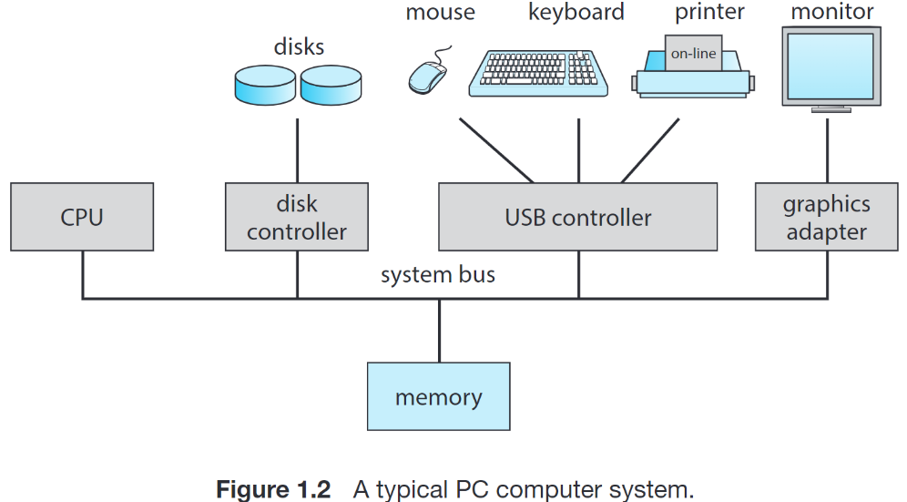
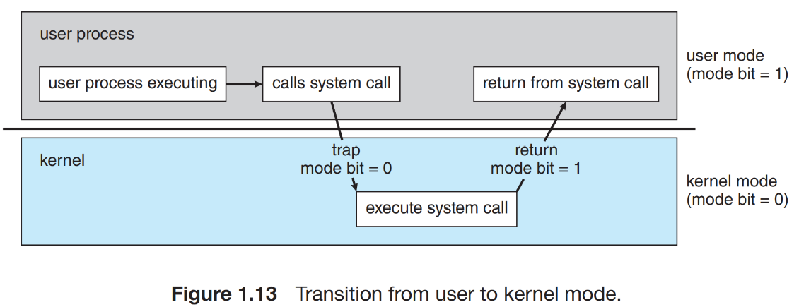

# OS Lecture Overview

## 成绩
- 期末 50%
- 平时5% + 课堂练习5%
- 实验报告20%+实验验收20%
实验列表：
独立
- lab0 RV64环境熟悉 2% 2周
- lab1 RV64系统启动：时钟和中断 6% 2周
合作
- lab2 线程与调度 6% 2周
- lab3 虚拟内存 6% 2周
- lab4 用户空间 8% 2周
- lab5 缺页处理 8% 3周
- lab6 fork机制 4% 3周
- lab7 文件系统 bonus 4%

教材：只上1-13

## 1. 操作系统overview

### 1.1 基本概念

### 1.2 操作系统历史/结构的种类

- 批处理系统batch processing systems. jobs在内存或者外存中。内存中始终有一个job在运行，os负责在结束后加载下一个开始运行（加载到内存里并运行的叫进程process）
- 多道批处理系统multiprogramming batch systems，在批处理系统基础上，当当前job发生IO时，操作系统负责让CPU转而运行另一个job。多道批处理系统避免了等待用户IO时的CPU时间浪费，但是不够友好，如果没有IO，CPU就只能执行一个job。
- 分时系统Time Sharing System。将CPU划分为非常小的时间片，OS负责安排各个job轮流运行。解决了上述问题：由于切换频率很高，看起来像多个进程在同时运行。分时系统是一种多道（multiprogramming）系统，允许多个job并发（concurrently）执行，但是不是批处理（batch）系统。

除了kernel外，OS还包含一些system programs辅助kernel工作。其它程序不属于OS，被称为application programs

⇒ 总之，OS是软件中最基础的部分，用以控制和管理系统资源，方便用户使用计算机。

### 1.3 中断

批处理系统是最容易理解的：每个程序像一个函数一样被OS调用。

其它系统：用到中断（interrupt）现代操作系统都是中断驱动的

CPU硬件有一条被称为interrupt-request line的线路，CPU每执行一条指令后都要检测一次。当CPU侦测到一个设备控制器在这条线路上发出的信号时，会读取interrupt number并以此作为interrupt vector中的index来跳转到对应的interrupt-handler routine。

中断向量表（interrupt vector）用来减少确定中断服务时的查找次数，即通过随机访问而不是遍历的方式找到处理程序。

在现代操作系统上，需要一些更复杂的中断处理功能：

1. 在关键程序处理期间延迟中断的处理
2. 一种高效的方法将设备中断发送给正确的中断处理机制
3. 需要多级中断，从而使得操作系统可以区分不同优先级的中断并根据适当的紧急程度进行响应

在现代的计算机硬件中，这些特新由CPU和interrupt-controller hardware实现。

大多数CPU有两条interrupt-request line

- 一条用于nonmaskable interrupt，为不可恢复的内存错误保留
- 另一条是maskable的，可以在执行不可恢复的中断的关键程序之前被CPU关闭，用于传送一些设备控制器的中断请求

在调用函数时需要保存PC等现场状态，执行中断时也要保存。值得注意的是，低级中断要被高级中断打断，但是保存和回复现场状态的过程不应当被打断。

计时器与分时系统的实现：

当操作系统将CPU的控制权交给一个程序前，会设定好一个计时器timer。timer通过一个时钟和一个计数器实现，当计数器的值为0时，就产生一个中断，这时控制权交给了OS。可以防止程序执行时间过长，也可以实现分时系统。

### 1.4 用户态与内核态，系统调用

Dual-mode & multimode

OS和用户共享计算机的硬件和软件。因此，一个错误的程序可能导致整个系统崩溃，或者使得其它用户的数据甚至OS本身被修改。因此OS的设计要保证一个错误的程序不会造成其它程序的错误运行。

系统代码能运行的指令：privileged instructions

CPU有一个mode bit，值为0，表示当前处于kernel mode（supervisor/system/privileged mode），值为1表示处于user mode。所有的interrupt handler都运行在kernel mode。

如果用户真的想执行特权指令，可以用system call，由OS代为完成。

OS能够执行的system call:

Process control
- create process, terminate process
- load, execute
- get process attributes, set process attributes
- wait event, signal event
- allocate and free memory

File management
- create file, delete file
- open, close
- read, write, reposition
- get file attribute, set file attribute

Device management
- request device, release device
- read, write, reposition
- get file attributes, set device attributes
- logically attach or detach devices

Information maintenance
- get time or date, set time or date
- get system data, set system data
- get process, file, or device attributes
- set process, file, or device attributes

Communications
- create, delete communication connection
- send, receive messages
- transfer status information
- attach or detach remote devices

Protection
- get file permissions
- set file permissions

因此当发生中断、system call、错误（除以0，或访问未知指令）等情况时，会发生user mode到

kernel mode的转换
