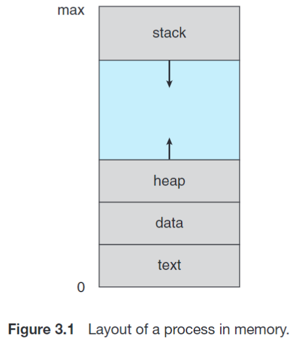
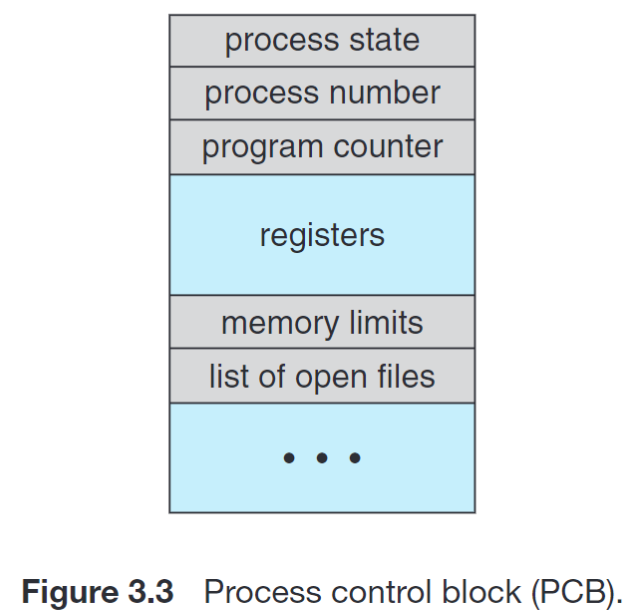
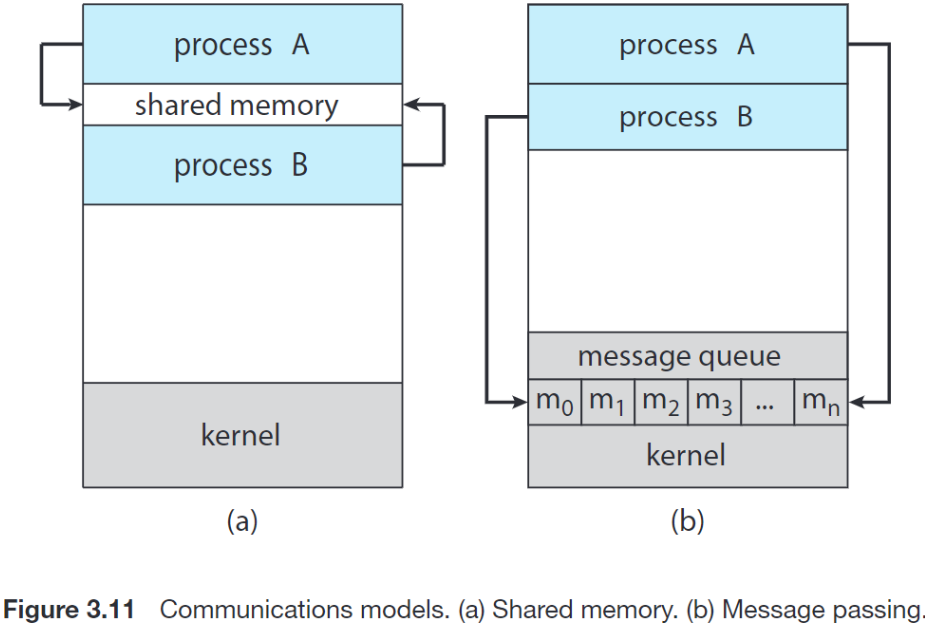
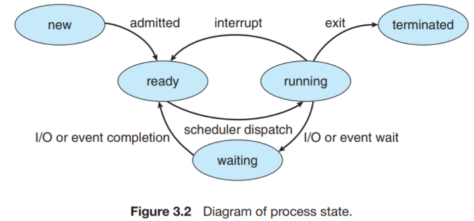
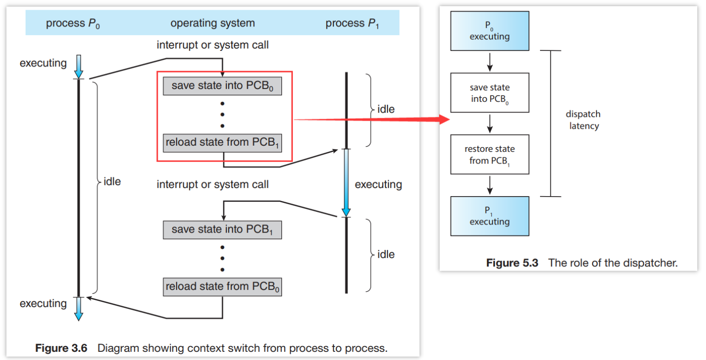
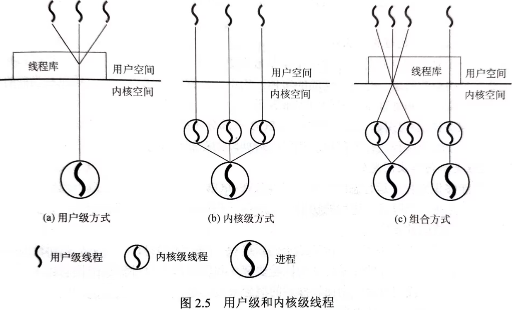
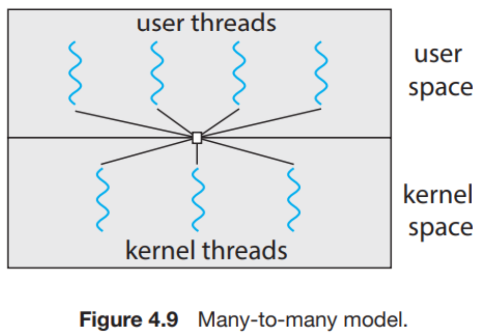
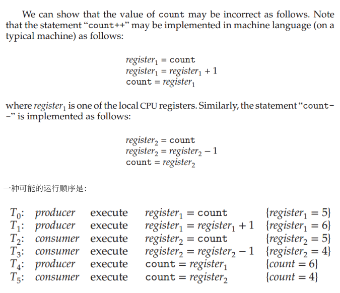
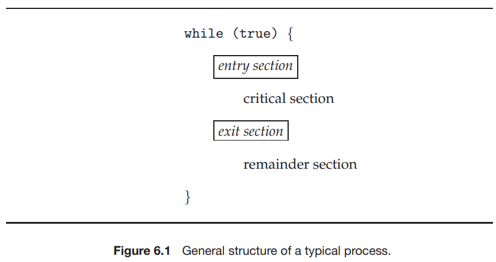
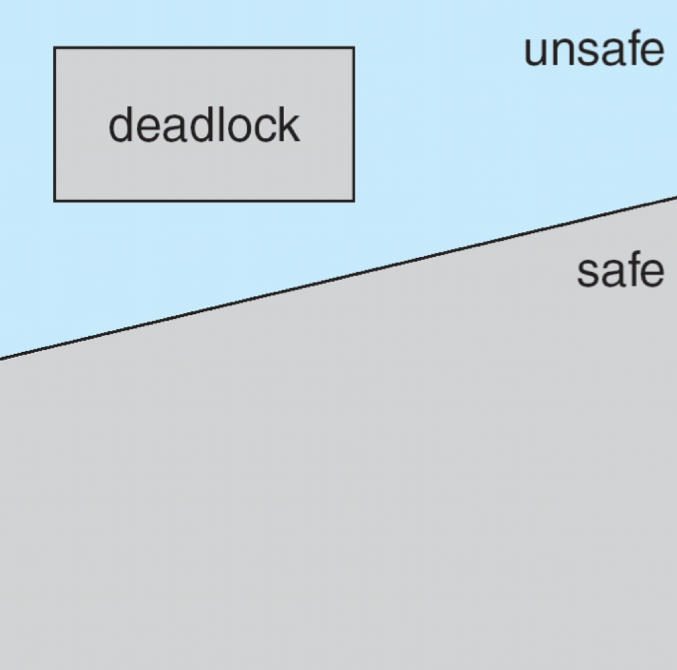

# OS Lecture 进程与同步

## 2. 进程 Process

### 2.1 组成

进程process（=作业job）是被加载到内存中正在运行的程序。多个进程可能对应同一个程序。一个正在运行的OS中会有多个进程，进程是程序的一次执行过程，是OS分配资源的基本单位。

进程的组成：一个进程包括
- code or text
    - 即程序代码，加载到内存前以executable file的形式存储在disk中
- program counter
    - PC，指向下一个要运行的指令
- counter of the processor’s registers
    - 在进程之间切换时，需要保存寄存器的值以便下次回到该进程时继续运行
- run time stack
    - 在ICS和汇编中学习过相关内容，其中的条目称为activation records（stack frames）
    - 由用户代码控制（编译时完成关于栈的相关调用），在调用函数时暂时存储一些数据，如local variables, return address, return values, state of registers, parameters等
- data section
    - global variables
- heap
    - dynamically allocated memory
    
    

### 2.2 进程的状态

进程在执行(execute)时会改变状态(state)：

一个处理器，只有一个进程可以running，更多的处于ready或waiting状态

### 2.3 进程控制块Process Control Block (PCB, aka. task control block)

表示进程，每个进程有且仅有一个PCB

PCB包含的关于当前进程的信息：
- process state 进程状态
- program counter
- CPU registers 进程相关的寄存器的值
- CPU scheduling information, properties, scheduling queue pointers, etc.
- Memory-management information
- Accounting information, CPU 使用时间，时间期限，记账数据等
- IO status information, 分配给进程的IO设备列表，打开文件列表等

PCB结构示意图

不同的系统可能有不同的PCB。Linux中的进程用结构体task_struct存储。

### 2.4 进程的创建，pid

OS通过一个唯一的标识符（process identifier, pid）识别进程。一个进程在运行时可以创建新的进程，则它成为父进程，新进程称为子进程。

父进程的pid称为子进程的ppid（parent’s pid）→ 形成进程树（process tree）

当子进程创建时，需要的资源（CPU时间、内存、文件、IO设备等）可以来自OS也可以继承（共享）自父进程。

UNIX系统通过系统调用fork()创建新进程，相当于拷贝了一份父进程，只改变pid和ppid，然后把子进程当前内存使用记录设0。fork()给父进程返回值是子进程的pid，给子进程返回0。

代码段：creating a separate process using the UNIX fork() system call.

```c
#include <sys/types.h>
#include <stdio.h>
#include <unist.h>
int main()
{
	pid_t pid;
	/* fork a child process */
	pid = fork();

	if (pid < 0){
		/* error occurred */
		fprintf(stderr, "Fork Failed");
		return 1;
	}
	else if (pid == 0) {
		/* child process */
		execlp("/bin/ls", "ls", NULL);// 对于用户给出的指定文件名，程序会在当前PATH环境变量下搜索
	}
	else {
		/* parent process */
		/* parent will wait for the child to complete */
		wait(NULL);
		printf("child complete");
	}
	return 0;
}

```

fork() 如何对父进程和子进程返回不同的值：当创建新进程时，父进程可以

- 继续运行（和子进程并发执行，即同时或交替运行）或
- 等待子进程运行完后再运行

子进程的地址空间有可能

- 使用父进程的拷贝或
- 加载一个新程序

为什么要拷贝一份，有的子进程不会用copy的地址。所以部分UNIX引入了copy-on-write机制，即将地址空间的复制推迟到需要写入的时候再进行。

getpid()和getppid()可以获得进程的pid和ppid。

### 2.5 进程的终止

进程调用exit()实现终止。也是C语言main函数返回时隐式调用的东西

当进程终止时，进程进入terminated状态，其资源被OS回收，但是pid，结束状态，资源使用情况仍然会被保存，因为父进程有可能会调用wait()来获取。

zombie processes: 子进程已终止，父进程还没有调用wait()

orphan processes: 父进程结束了，子进程没结束。有些OS会把子进程结束掉，UNIX会让init称为其父进程。

### 2.6 进程间通信IPC，InterProcess Communication

是为了在进程的资源相互隔离（？）的情况下，让不同的进程能相互访问资源，协调工作。

- 共享内存shared memory：两个进程各有一块虚拟内存，映射到同一块物理内存。共享内存也需要信号量等同步手段保护。
- 消息传递message passing

- 信号量semaphores：本意用来线程间同步，但是可以通过sem_open()系统调用来建立和维护进程间的信号量。
- 共享文件
- 管道pipe，也是一种文件，半双工信道
- 消息队列message queue：操作系统维护的链表，进程可以新建或连接到消息队列，并写入或读取消息
- socket：TCP/UDP

## 3. 调度Scheduling

多道multiprogramming环境下，进程的个数通常大于CPU个数。

CPU调度是OS关于哪个ready进程可以运行和运行多久的决定。

具体来讲一次调度应该是指OS将一个进程从5种状态中的一种切换到了另一种的过程。

目标是始终允许某个进程运行以最大化CPU利用率，同时保证一定公平性。

调度不一定是CPU调度，有可能发生在所有场景。

调度的原因是能够供给的资源数量远小于请求的数量。

### 3.1 调度的时机

CPU调度出现在任意一个进程，有如下5种转换

- running → waiting, 如等待IO
- running → terminated
- running → ready，当发生了中断，如计时器时间到了
- waiting → ready，如IO完成了
- new → ready

好看一点的看图吧

调度按时机分类分两种

- 非抢占式调度nonpreemptive：只会做running2waiting或者running2terminated，此时进程不再运行了
- 抢占式调度preemptive：发生上述5种

<aside>
💡 Q：调度和中断+异常的区别

A：（用户态）调用（进程），目标是进程状态变化；（内核态）对（用户态）做trap，目标是谁用CPU

A：其实中断程序也可以是一个进程

在此致谢 @isshiki修 和 @vinci 的回答

</aside>

### 3.2 过程（上下文切换，context switchin）

调度的过程就是上下文切换，感觉这个名字说的是对于正在运行的CPU里的进程，所谓上下文就是PCB内容。

### 3.3 调度算法评价

- Maximize CPU utilization CPU使用率：即CPU非空闲的时间比例
- Maximize Throughput 吞吐量：每个时间单元内完成的进程
- Minimize Turnaround Time 周转时间：从进程创立到进程完成的时间，等待进入内存+在ready queue等待+在CPU上执行+IO执行+…
- Minimize Waiting Time 等待时间：在ready queue中等待所花的时间之和
- Minimize Response Time 响应时间：交互系统从进程创立到第一次产生响应的时间

这些目标可能的冲突：
- context switch vs. throughput
- context switch vs. response time

### 3.4 调度算法

First-come first-serve (FCFS) | Nonpreemptive

先申请CPU的进程先用，可以用一个FIFO队列实现。

它会导致convey effort: short process behind long process, 尤其是当有线程进入waiting后，再返回的时候又要重新排队。

Shortest-job-first (SJF)

SJF的核心想法是让下一次运行时间最短的进程先来运行 ⇒ 能得到最少的平均等待时间

下一次运行时间 = （非抢占式调度）进程总时间（因为进程不可能被打断）=（抢占式调度）进程的剩余运行时间

会分开计算就行

SJF在两种调度方法都能获得最小平均等待时间

问题是我们不知道下一次运行时间 → 所以要猜，猜的算法是之前CPU执行长度的指数平均

Round-robin (RR) in preemptive

做法：定义一个时间片（time slice/time quantum），即一个固定的较小的时间单元，如果process不是唯一在ready queue中的进程，那就不会连续运行超过一个时间片的时间。ready queue是FIFO的。

性能：比起SJF平均等待时间更长，但是降低了response time。性能好坏基本上取决于时间片大小，response time和overhead冲突。如果时间片→inf，相当于RR→FCFS

时间片一般用10~100ms, context-switch一般花10mius

Priority Scheduling

优先调度优先级最高的进程（根据课本的例子，优先级好像是不会重复的）

优先级标准：

- internal: 一些测量数据，如SJF是priority的一个特例，即优先级由CPU预测运行时间决定
- external: 用户指定

可以用priority queue实现

可以与RR结合，这时候ready queue是用priority queue实现的

Priority Aging：解决indefinite blocking / starvation，即低优先级的进程可能永远不会被执行。可以根据等待时间逐渐增加priority。

Multilevel Queue Scheduling

可以将进程分为不同的组，每个组内有不同调度算法的ready queue，组和组之间也要调度。

组内：一般前台队列使用RR以保证response，后台可以FCFS

组间：通常给队列设置优先级，用preemptive priority scheduling。也可以使用组间time-slicing

Multilevel Feedback Queue Scheduling

上一个版本的加强版。允许进程在组间迁移。

过程

- 按照FCFS原则，设置N个就绪队列为Q1，Q2，…QN，每个队列之间可以放很多作业
- 为N个就绪队列赋予不同优先级，第一个队列优先级最高，第二个队列次之，其余逐个降低
- 设置每个就绪时间片优先权越高，算法赋予队列的时间片越小。按照实际作业（进程）的需要调整
- 进程等待时首先进入待调度的队列等待时，首先进入优先级最高的Q1等待
- 首先调度优先级最高的队列中的进程，若高优先级中队列中没有已调度的进程，则调度次优先队列中的进程
- 对于一个队列中的各个进程，按照（时间片轮转去调度），比如Q1的时间片为N，那么Q1的作业在经历了时间片为N的时间后，若还没有完成，则进入Q2，这样一直进入下一级，直到最后一级是FCFS
- 在低优先级的队列中的进程在运行时，又到达新的作业，那在运行完这个时间片后，CPU马上分配给新到达的作业即抢占式调度CPU

这种算法的performance根据具体操作系统和具体实现而异。

## 4. 线程 threads

### 4.1 动机和概念

开销：

- 进程在fork（创建）的时候有较大的开销
- 上下文切换有较大的开销

因为若干进程可能共享一些内容，如果OS知道这些共享，就能减少新建进程的开销及进程切换的时延。

⇒ 引入线程threads，线程属于进程

它也有thread id (tid), PC, register set 和 runtime stack。

线程与同一进程的其它线程共享code section, data section, heap, open files, signals

Linux中线程也叫轻量级进程Light Weight Process。

如果OS支持线程，那调度的就是内核级线程而不是进程，也就是说线程是运行以及CPU调度的基本单元。

区分：进程是分配资源的基本单元

### 4.2 优缺点

多线程编程Multi-Threaded Programming的优点有：

- economy：建立线程经济，因为code data heap都已经在内存里了（不用再copy？），另外同一进程的线程之间context switch也会更快，因为不用flush cache。
- resource sharing：同一进程的线程之间天然共享内存，因此无需为之编写IPC，也允许对同一块内存进行并行处理。
- responsiveness：多线程进程会有更好的响应性。
- scalability：多处理器的体系结构上多线程进程可以更好发挥作用，因为每一个线程运行在一个处理器上，对比单线程进程只能运行在一个处理器上。

缺点

- 一个线程出现错误，整个进程都会去世（比如浏览器一个网页挂掉使整个浏览器挂掉）
- OS对每个进程地址空间大小限制，但多线程会占更多内存
- 共享内存使内存保护变复杂

### 4.3 实现方式：用户级/内核态，多线程模型

- 用户级线程user-level thread：在OS上只是一个进程，这个进程包含线程库thread library，负责线程的创建和切换；内核级线程由OS支持这些操作
    - 用户通过OS提供的线程库函数创建，
    - 优点：1）不占用OS的tid，理论上可以支持比内核级线程更多的线程数 2）调度等操作在用户态，不需要进入内核态 3）容易实现自定义的调度算法
    - 缺点：1）一旦当前正在运行的线程阻塞，那么OS看来就是整个进程被阻塞了，就会认为该进程的其它线程也阻塞了。如果是内核级线程就只阻塞这个线程 2）同一个进程中的多个用户级线程无法在多核上分别运行
- 内核级线程kernel-level thread：

多线程模型：有的OS同时支持用户级和内核级，有几种用户级和内核级的映射方法

（1）等于只支持用户级

（2）等于只支持内核级

（3）m个用户级可以映射到n个内核级

Linux线程：没有特别区分进程和线程，都是叫task

不知道这里考不考要是考了回去refer一下

[5 线程 - 咸鱼暄的代码空间 (xuan-insr.github.io)](https://xuan-insr.github.io/%E6%A0%B8%E5%BF%83%E7%9F%A5%E8%AF%86/os/II_process_management/5_thread/)

## 5. 同步和同步工具 Synchronization

Synchronization就是规定进程所做的工作之间的顺序或者先序关系，从而防止一些非法情况发生的方法。

### 5.1 引入和CS Problem

Cooperation process是可以影响系统中其它运行进程或被其它进程影响的进程。

Cooperating System会

- 共同使用一些数据，可能是直接使用同一段地址空间（代码+数据），或者是通过共享的内存或信息共用一些数据
- 对数据的同时访问concurrent access可能会导致data inconsistency，因为数据的一致性需要cooperating process有序的运行

e.g. Bounded-buffer problem

给定两个进程producer和consumer，共用大小为n的buffer。

producer生产数据放入buffer，consumer从buffer中使用数据

限定条件：producer不应在buffer满时放入数据，consumer也不应当在buffer空时取出数据

想象中的两个进程

```c
/* producer process */
while (true){
	/* produce an item in nert_produced */
	while (count == BUFFER_SIZE)
		; /* do nothing */
	buffer[in] = next_produced;
	in = (in+1) % BUFFER_SIZE;
	count++;
}
/* Consumer Process */
while (true){
	while (count == 0)
		; /* do nothing */
	next_consumed = buffer[out];
	out = (out + 1) % BUFFER_SIZE;
	count --;
	/* consume the item in next_consumed */
}

```

如果count的值是错误的？

例子的意思是，++和—都是系统实现的，如果共用count读取的时间恰好撞上，count的值就不对

出现这种情况的原因是我们允许两个进程同时操纵变量count。

e.g. kernel中：两个进程 P0 和 P1 同时 `fork()` 时，如果不加限制，可能会出现类似前例的情况，即在某一个进程把当前的 `next_avaliable_pid` 分配给他的 child 后，在没来得及更新 `next_avaliable_pid` 前，另一个进程使用了 `next_avaliable_pid` 来给 child 分配 PID，这就会导致两个不同的线程使用同一个 PID 的情况。

**Race Condition**：多个进程同时操控一个数据，由操控出现的顺序决定结果

必须保证同一个时间只能有一个进程操控某个变量。

The Critical-Section Problem （CS Problem）

考虑一个有n个进程的系统，每个进程中都有一段代码可能修改其他至少一个进程公用的数据，称为critical section。这个系统需要满足的重要性质是，当一个进程正在运行critical section时，其它进程都不能进入critical section

将这个问题称为critical section problem，也就是要设计一种达成一致行的方法。或者说设计一种让各种进程同步从而安全共享数据的协议。

这段程序的示意图如下：

每个进程必须在entry section中申请进入critical section的许可；在critical section运行结束后进入exit section，在这里许可被释放。

❗❗❗

Critical section problem的解决方法必须满足如下三个要求

- Mutual exclusion：没有两个进程可以同时在运行critical section
- Progress：系统整体上是在运行的
    - 要么有一个进程在运行它的critical section
    - 要么没有进程在critical section
    - 要么有限时间内要有一个进程被选入它的critical section
- Bounded waiting：任何一个进程等待进入critical section的时间是有限的。即当一个进程进入critical section的请求后，只有有限个（次）进程会在它之前进入critical section。

接下来我们介绍的算法都是在一步一步满足这三个要求

Kernel中的CS Problem

- 对于单核系统：可以在entry section中，对critical section禁止中断，然后在exit section中恢复
- 对于多核系统：中断消息需要传到所有处理器，消息传递会延迟进入临界区，会降低效率。同时也影响时钟中断。

需要保证kernel的设计实现了critical section

kernel的实现分两种类型：

- 抢占式内核 preemptive kernel
- 非抢占式内核 nonpreemptive kernel

区别是是否允许kernel mode被抢占

抢占式内核更难设计，但同时也响应更快。

### 5.2 Peterson’s Solution

省流：让两个进程共享一个变量，既有turn（轮到谁能进去）也有flag（进程是否ready）。当flag[某个进程]且turn=该进程，就可以进去。

<aside>
💡 想要理解PS算法，请想象两个人互相让座，A先说你坐吧，B再说你坐吧，这时A坐下。

A获得椅子有两个充要条件：

A想坐: flag[A] = 1

在B让座之前，A已经让过座了: turn ≠ A 说明之前turn曾经被赋为A，现在是B

</aside>

```c
int turn;         // who is allowed to enter
boolean flag[2];  // ready to enter its CS

void foo(){
	while (true){
		flag[i] = true; // mark self ready
		turn = 1-i;     // assert that if the other process wishes to enter its CS, it can do so;
		while (flag[1-i] && turn = 1-i); // wait
		/* critical section */
		flag[i] = false;  // set ready to false
		/* reminder section */
	}
}

```

其中 `i` 是0或1，表示第i个进程。 `turn` 是当前有权进入critical section的进程（0或1）; `flag` 是第i个进程是否准备好进入critical section，初始值均为FALSE。

To enter the critical section, process Pi first sets `flag[i]` to be true and then sets `turn` to the value `1-i` (the other process), thereby asserting that is the other process wishes to enter the critical section, it can do so. If both processes try to enter at the same time, `turn` will be set to both `0` and `1` at roughly the same time. Only one of these assignments will last; the other will occur but will be overwritten immediately. The eventual value of `turn` determines which of the two processes is allowed to enter its critical section first.

Peterson’s Solution满足同步算法必须满足的三个性质：

- Mutual exclusion 互斥
    - 用了一个例子说不可能有两个进程同时进入Critical Section
- Progress Requirement 空闲让进
    - 如果没有进程在CS，而有一些进程在Enter section，不能让想要进入CS的进程无限等待
    - 经过有限次等待以后，需要进入，避免Starvation
- Bounded Waiting 让权等待
    - 是否能进入critical section需要其它进程来决定

Bakery Algorithm：

> 2个进程版本的PS。需要遍历所有进程查看大家的turn
> 

Reordering 重排序

PS的缺点是在现代计算机体系结构上不一定适用。因为现代的处理器和编译器可能会为了优化性能而对一些读写操作进行重排。

重排的时候会考虑重排在单线程程序中的合理性（计算结果是稳定且正确的）。但是这样不能保证在多线程共用数据时的正确性，可能在多线程共用时出现不确定或不对的输出。

e.g. 编译器和处理器可能会对数据读取顺序进行reorder，以使不需要交替读取两个数据的值，而是相同读取放在一起。

为了解决重排序导致的在多线程下不稳定，我们引入：

Memory Barrier

它用来保证其之前的内存访问先于之后的完成。即，在某个操作前，内存的改变对其它处理器上的进程都是可见的。

加memory barrier的一种方法

```c
while (!flag)
	memory_barrier();
print x;

```

这样就保证了flag在x之前被加载了。

Memory Model

另外，在现代的体系结构上，一个线程写了对应的变量后可能不会立即写回内存，这也有可能导致问题。

计算机体系结构决定哪块内存给哪个程序的方法，叫做memory model。memory model有两种类型

- Strongly ordered: a memory modification on one processor is immediately visible to all other processors.
- Weakly ordered: modification to other memory on one processor may not be immediately visible to other processors.

### 5.3 硬件指令

有两个硬件指令能帮助实现互斥和同步

许多现代系统提供硬件指令来修改word的内容，或者用于atomically (uniterruptably，不可被打断地)交换两个word。

用户一般不用关心特定机器指令，可以用指令 `test_and_set()` 和 `compare_and_swap()` 抽象了解这些机器指令背后的含义。

`test_and_set` 的定义是把一个true输入到硬件，并且把变量原来的值返回。它是一个基本指令器件。

```c
bool test_and_set(bool *target) {
	bool rv = *target;
	*target = true;
	return rv;
}

```

它的重要特征是，它的执行是atomic的。

这个指令可以用来实现mutual exclusive: 定义一个bool变量 `lock`，初始化为false。

为什么可以：如果 `lock` 在 Entry Section 时为 true，那么 `test_and_set(&lock)` 将返回 true，因此会始终在 while 循环中询问。直到某个时刻 `lock` 为 false，那么 `test_and_set(&lock)` 将返回 false 同时将 `lock` 置为 true，进程进入 Critical Section，同时保证其他进程无法进入 Critical Section。当持锁的进程完成 Critical Section 的运行，它在 Exit Section 中释放 `lock` ，从而允许其他进程进入 Critical Section。而如果某个时刻 `lock` 为 false，而有两个或多个进程几乎同时调用了 `test_and_set(&lock)` 。但由于它是 atomic（none-or-all）的，因此只有一个进程可以返回 false。

不能实现bounded waiting怎么办，有的进程可能就一直没有拿到锁：加一个循环遍历找下一个可以进入的进程，每个进程最多等全部遍历完一遍就轮到自己

```c
while (true){
	/* Entry Section */
	while (test_and_set(&lock))
		; /* do something */
	/* Critical Section */

	/* Exit Section */
	j = (i + 1) % n;
    while ((j != i) && !waiting[j]))
        j = (j + 1) % n;
    if (j == i)
        lock = false;
    else
        waiting[j] = false;

	/* Remainder Section */

}

```

`compare_and_swap()` 用软件来实现性能非常差，用软件来实现会变好。它的定义是

```c
int compare_and_swap(int *value, int expected, int new_value){
	int temp = *value;
	if (*value == expected)
		*value = new_value;
	return temp;
}

```

可见其实`compare_and_swap()` 与`test_and_set()` 作用类似。

用`compare_and_swap()` 实现mutual exclusive

```c
while (true) {
    /* Entry Section */
    while (compare_and_swap(&lock, 0, 1) != 0)
        ; /* do nothing */

    /* Critical Section */

    /* Exit Section */
    lock = 0;

    /* Remainder Section */
}

```

### 5.4 信号量 Semaphores

是一个整型变量，除了初始化外，只能通过两个atomic操作 `wait()` 和 `signal()` 来访问。

```c
void wait(S){
	while (S <= 0)
		; /* busy waiting */
	S--;
}
void signal(S){
	S++;
}

```

有两种semaphore：

- counting semaphore：S的值不受限制
- binary semaphore: S的值只能是0或1，类似与互斥锁。

e.g. Consider P1 and P2 that require S1 to happen before S2, create a semaphore “synch” initialized to 0.

```c
P1:
	S1;
	signal(synch);
P2:
	wait(synch);
	S2;

```

如果想要解决semaphore的busy waiting问题，可以引入waiting queue

```c
typedef struct {
    int value;
    struct list_head * waiting_queue;
} semaphore;

wait(semaphore *S) {
    S->value--;
    if (S->value < 0) {
        add this process to S->list;
        block();
    }
}
signal(semaphore *S) {
    S->value++;
    if (S->value <= 0) {
        remove a process P from S->list;
        wakeup(P);
    }
}

```

可能会导致deadlock

### 5.5 Atomic Variable

那就直接用`compare_and_swap()` 来做成一些atomic的机器指令工具

e.g. count++ 是可以打断的，但是可以设计一个不可打断的increment(&count)

```c
void increment(atomic_int *v){
	int temp;
	do {
		temp = *v;
	} while (temp != compare_and_swap(v, temp, temp+1));  // 它不会被打断
}

```

要记得它只能解决变量更新过程中的race condition。此时只有待更新变量一个变量在等待读取。如果有两个consumer等待读取，但count改变时只会产生一个值在buffer里，那就不行。

### 5.6 Mutex (Mutual Exclusion Lock)

用软件方法解决CS。

让进程先在entry section申请acquire()一个锁，然后在exit section release()一个锁。然后用一个bool变量来看它是否available

```c
while (true){
	acquire();
	/* critical section */
	release();
	/* remainder section */
}

void acquire(){
	while (!available)
	; /* busy waiting */
	available = false;
}

void release(){
	availble = true;
}

```

因为还需要保证互斥，需要保证acquire是原子性的，那就用上述两个硬件工具来实现。代码同对应节，不赘述。

缺点：需要busy waiting，当有一个进程在CS中时，其它进程需要在acquire()中spin，所以也称为spinlock。如果有N个进程同时使用一个CPU，那么将大约有(N-1)/N的浪费。如果有进程在企图acquire一个锁时被组织，称它为contended（被争夺）；反之称为uncontended。

还可以考虑下面的设计，其中yield()会使程序从running转为ready，从而让出CPU

```c
void acquire() {
    while (compare_and_swap(&avaliable, 1, 0) != 1)
        yield();
}

void release() {
    avaliable = true;
}

```

（这个地方真的真的没看懂）

### 5.7 Priority Inversion

e.g.

Three processes PL, PM and PN with priority PL < PM < PH.

PL holds a lock that was requested by PH → PH is blocked.

PM becomes ready and preempted the PL

It effectively inverts the relative priorities of PM and PH.

具有中等优先级的PM影响了高优先级的PH的等待时间，这样是不对的。

解决方案：

可以通过优先级继承priority inheritance来解决。所有正在访问资源的进程（如PL）需要获得访问这个资源的更高优先级的进程的优先级（PH），直到其用完有关资源为止。比如上例中，PL会临时继承PL的优先级，然后PH运行，最后PM运行。

## 6. 经典同步问题

一般我们用信号量解决问题

信号量的逻辑：一个信号量用来表示一类“资源”的余量。wait()等待到其有余量时从中取走一个，而signal()释放一个资源。

（上边这段在写什么）

### 6.1 Bounded-buffer Problem

<aside>
💡 给定两个进程：producer和consumer，共用大小为n的buffer。producer生产数据放入buffer，consumer从buffer中取出数据并使用之。

该问题需要保证：producer不应当在buffer满时放入数据，consumer也不应当在buffer空时取出数据。

</aside>

首先，根据我们在前一节中的讨论，produce和consume的过程会访问到buffer的资源，因此访问buffer是critical section，我们需要使用一个锁（或者信号量）来控制对buffer的访问。

讨论了一下锁永远不可能有最优解：没看懂

```c
semaphore lock = 1;
semaphore eslot = BUFFER_SIZE; // 空闲buffer的数量
semaphore fslot = 0;

producer(){
	while (true){
		wait (eslot); // if buffer is full. i.e. eslot == 0, wait. else eslot --
		wait (lock);
		add_to_buffer(next_produced);
		signal(lock);
		signal(fslot); // fslot ++
	}
}

consumer(){
	while(true){
		wait(fslot);  // if buffer is empty. i.e. fslot == 0, wait. else fslot--
		wait(lock);
		next_consumed = take_from_buffer();
		signal(lock);
		signal(eslot); // eslot ++
	}
}

```

### 6.2 Reader-Writer Problem

<aside>
💡 对一个数据，readers读，writers读和写

设计方案保证：多个readers可以同时读取，但是writer进行读写时不能有其它writers和readers。

</aside>

```c
semaphore write_lock = 1;
int reader_count = 0;
semaphore reader_count_lock = 1;
semaphore writer_first = 1;

writer() {
    while (true) {
        wait(writer_first);
        wait(write_lock);
        read_and_write();
        signal(write_lock);
        signal(writer_first);
    }
}

reader() {
    while (true) {
        wait(writer_first);
        wait(reader_count_lock);
        reader_count++;
        if (reader_count == 1)
            wait(write_lock);
        signal(reader_count_lock);
        signal(writer_first);

        read();

        wait(reader_count_lock);
        reader_count--;
        if (reader_count == 0)
            signal(write_lock);
        signal(reader_count_lock);
    }
}

```

### 6.3 Dining-Philosophers Problem

<aside>
💡 5个哲学家一起吃饭。每两个哲学家之间有一根筷子，每个人一次可以拿起一根筷子，拿到两根筷子的就可以吃一段时间，吃完思考一段时间。


</aside>

三种解决方案：

- 可以的话，所有人拿起左边的筷子 → 有的时候可能每个人同时拿起左边的筷子，导致死锁
- 只允许同时拿起两根筷子：轮流询问每个人是否能拿起两根筷子，如果能则拿起，不能则等待放下
- 奇数人先拿左边筷子，偶数人先拿右边筷子

## 7. 死锁 Deadlocks

是指多个进程因竞争资源导致的一种僵局，即若干进程各持有一些资源，同时等待获取另一个进程持有的资源，形成的互相等待局面。

e.g.

两个进程，两个磁盘驱动器

```c
semaphore first_mutex = 1;
semaphore second_mutex = 1;

thread_one() {
    wait(first_mutex);  // 持有一个
    wait(second_mutex); // 想要另一个
    // ...
}

thread_two() {
    wait(second_mutex);
    wait(first_mutex);
    // ...
}

```

可以通过分配优先级来解决，但是优先级可能导致starvation

### 7.1 资源分配图 system resource-allocation graph

是一种对系统资源和想使用资源的实例进行建模的规范化作图标准

假设有m个资源(resources) R1… Rm，每种资源有W个实例（instance）。各个活动进程P1…Pn会利用这些资源，每个资源的利用由request, use, release三步组成。

资源分配图是一种有向图

- 点集 V = P \and R
    - 活动进程集合 P = {P1, … Pn} 用圆表示
    - 资源类型集合 R = {R1, … Rn} 用矩形表示，里面用圆点个数表示各个资源实例
- 边集
    - 申请边 request edge P → R 表示进程已申请并在等待资源。圆指向矩形
    - 分配边 assignment edge R → P 表示资源已经分配给了进程。矩形里的圆点指向圆

没有环一定没有死锁，有环可能但不一定有死锁，有环且每个资源只有一个实例一定有死锁。

### 7.2 死锁的必要条件

<aside>
💡 想要理解这一块，请想象四个成环的公交路口，每个公交路口都堵着一排想要顺时针前行的车。每个车都想进入下一个路口，但是每个路口都被上一辆车堵着

</aside>

下面四点的交

必要条件→打破任意一点就能避免死锁

- Mutual exclusion：至少一个资源处于非共享模式（即每个资源只有一个实例）
- Hold and wait：每个进程占有至少一个资源，并等待另一个被占据的资源。
- No preemption：资源不能被抢占，只能在进程结束后主动释放。
- Circular wait：一组等待进程跟想要的资源的占有者进程成环，也就是进程编号与需要的资源编号形成一个完全轮换（没有一个进程对应与其编号相同的资源，而编号相同的资源指该进程当前正持有的那个资源）（我是这么理解的）。在阐述这一点时，可以列出这个轮换。

处理死锁的四种方法

- 保证系统不会进入死锁
    - 死锁预防 (deadlock prevention)
    - 死锁避免 (deadlock avoidance)
- 在系统进入死锁状态后恢复
    - 死锁检测和恢复 (deadlock detection and recovery): 例如数据库
- 假装系统不会发生死锁，真发生了就寄：？
    - 大多数操作系统(including Linux and Win)采用，需要软件来处理死锁

### 7.3 预防，银行家算法

预防的核心思路就是打破必要条件中的任何一个。分别讨论四个条件如何破坏

- Mutual Exclusion
    - 通过保证系统资源能够共享来打破
    - 但是不一定能实现，很多资源不能共享e.g. 信号量
- Hold and Wait
    - 通过保证每个进程申请资源时不能占有其它资源
    - 程序直到开始执行前才申请所有资源
    - 或者只允许进程在没有资源时才申请资源
    - 缺点是资源利用率会变低，需要资源较多的进程会发生starvation
- No Preemption
    - 当一个进程请求资源但没有得到满足时，它必须释放已经持有的所有资源，直到它需要的所有资源（包括刚才释放的那些资源）都可用时才能一并获取并继续执行。
    - 信号量不能这样释放
    - 会降低资源利用率
- Circular Wait
    - 对所有资源进行排序，要求每个进程按照递增顺序申请资源
    - 如果程序开发者没有按此顺序执行，就会死锁
    - 也可能影响资源利用率

### 7.4 避免

避免死锁则是靠预测进程未来需要使用哪些资源、资源的使用顺序等。系统需要设计算法计算一下来避免。所以既需要额外信息，又需要额外算法。

额外信息包括

资源分配状态resource allocation state:

- 每个进程声明可能对每种资源类型的最大需求（maximum demands）
- 当前系统的available和allocated的资源数目

资源分配图算法：适用于每种资源都只有一个实例的情况

在资源分配图上加一种边：claim edge。表示一个进程可能会需要某种资源，用虚线表示。转化关系为

```mermaid
graph TD
	claim_edge --需求出现--> request_edge
	request_edge --不会出现环的话就需求满足--> assignment_edge
	assignment_edge --资源释放--> claim_edge

```

安全状态 Safe State

是指按照一定顺序为每个进程分配资源，同时避免死锁。

具体而言，如果某个资源有A个空闲，对于每个活动进程Pi，各自持有Ci个该资源，并且仍然需要Di个资源。

如果一个序列<P1, … Pn>使得对于任意Pi，都有A+\sum[j<i][j=1]{Ci} ≥ Di, 则系统处于安全状态。

可以用归纳法证明：如果Pi的需求不能被立刻满足，只需要等待Pj | j<i 全部完成。Pi就能获得所需资源

安全状态是非死锁状态的子集

银行家算法 Banker’s Algorithm

通过available, max, allocation, need 这四个矩阵刻画一个时间内各个进程对各种资源的持有和需求状况，以及当前系统的资源情况。OS应使用这些数据判断系统是否安全状态。

找一个安全序列的基本思路是：选一个need（的每一项对应地）小于available（的对应项）的进程，运行完后会将allocation释放回available.

假设这个需求被接受了，更新对应的need，available，allocation

在此状态下推演是否有合法的安全序列。

而决定一个需求是否应当被满足的方案是，假设被接受了，根据该需求更新need，available，allocation，在此状态推演是否有合法的安全序列。

### 7.5 检测

Single Instance Resources

wait-for graph来解决

在这个图里找环，用拓扑排序时间复杂度是O(V+E)的，最差情况下是O(n^2)的。

Multi-Instance Resources

类似银行家算法，如果找不到任何安全序列，说明系统处于死锁。

### 7.6 恢复

- 进程终止Terminate deadlocked processes
    
    它和资源抢占的区别似乎是，进程终止代价非常大，其一是需要维护终止时的状态，并需要重新计算一些内容，并需要避免产生重复的副作用。
    
    直接放弃所有进程花费会很大。
    
    可以选择每次放弃一个进程，直到所有死锁环解除。
    
    如何选择放弃哪个进程：一系列指标
    
    - 进程的优先级
    - 已经算了多久，还要算多久
    - 用了哪些、多少资源，是否容易被抢占
    - 还需要多少资源
    - 终止这一进程的前提是还需终止多少进程
    - 进程是交互的还是批处理的
- 资源抢占 Resource Preemption
    
    不断抢占资源给其它进程，直到消除死锁环为止
    
    需要考虑三个问题
    
    - 选择牺牲进程 select a victim：与进程终止的选法相似
    - 回滚（Rollback）：当一个进程的若干资源被抢占，需要将这个进程回滚到某个安全状态，即回滚到申请那些被抢占的资源之前
    - 饥饿（Starvation）：如何保证不会永远从一个进程中抢占资源，可以在代价评价中加一个指标回滚次数。这个指标的设计思想类似于priority aging