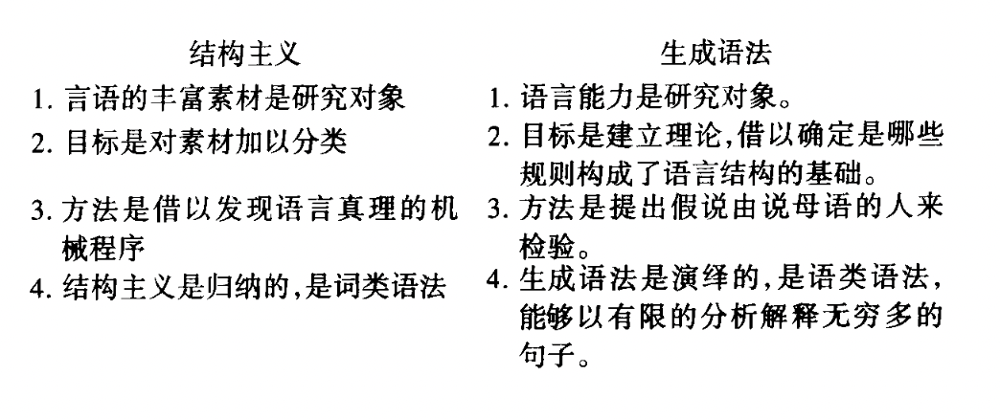
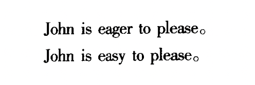

Nov. 9th. 2022
## 这次talk会讲什么
✅ 介绍语言哲学的思潮流变历程，介绍语言上的实验思想实验，讨论一些语言学、认知、逻辑和哲学的关联
## PoL
语言哲学的基本问题：
1. 语言和世界的关系
2. 语言或语词的意义问题

语言哲学和语言学
语言学和语言哲学的联系紧密，但是是两门学科。
20世纪哲学上发生了语言转向，这也是现代语言学形成的时候。
语言学是对语言规律和这些规律的应用的研究，语言哲学更关心语言更本质更抽象的意义。

## History of PoL
莱布尼茨：提出逻辑语言，简历人工语言的努力
强调自然语言依赖于知识，因此分有知觉的模糊、歧义等种种缺陷。自然语言不是描述客观事物的最佳工具，为了探究真理，必须建立一个由普遍符号组成的更为清楚的符号体系。这种努力在数学方面是卓有成效的，比如微积分符号。

索绪尔：
索绪尔最大的影响是《普通语言学》。我们一般认为索绪尔是一位语言学家，但是他在这本书中提出的“能指”与“所指”理论，是哲学里的符号学的开端。
语言是用声音表达思想的符号系统，符号是用以表示者和被表示者的结合。
我们会说，声音本身不能施指，只有处在某种特定关系中（语言定义了声音和实体之间的关系），声音才有了意义。
任意性原则是，如此这般的施指和如此这般的所指结合而成的一个符号，是任意的。eg. 颜色与颜色词的联结是任意的，颜色的界限与颜色词的联结也是任意的。

```

"绿"不仅和绿颜色相连，而且和“蓝”“青”等语词相连。
如果没有“蓝”“青”，我们就不能知道“绿”所界定的颜色范围。

“七色彩虹”
日语不区分“蓝”和“绿”，只有一个单词“青”（aoi），日语母语者在鉴别蓝色和绿色时反应时高于英语母语者。
一种北欧语言有七种蓝色的名称。
```

我们习惯把语词和情境的联系称作纵坐标或语境坐标，把语词之间的联系称作横坐标和逻辑坐标。
eg. 完形填空题


eg. 数据库关系模型的属性、元组


非常有趣，索绪尔写这本语言学教材时，世界上并没有符号学这个学科。在他提出“能指””所指“这个概念后，符号学在他”能指“在”所指“的链条上滑动这一论断的基础上诞生，并至今成为法国哲学的一个重要问题。

弗雷格：
弗雷格是公认的分析哲学、语言哲学和现代数理逻辑的开创者。

《概念文字：一种模仿算术语言构造的纯思维的形式语言》主要工作是，设计了一套人工符号系统，排除了自然语言中修辞之类的东西，专注于概念本身和概念之间的联系，因此，它将排除自然语言的模糊性和不确定性。用这套符号系统来重新表述算术的基本概念和推理规则，明确所有推理的前提，保证一个证明中各个命题间的所有推理规则，使推理不再基于直觉，也没有跳跃和脱节。

对语言哲学影响最深的是他在《算术基础》中提出的三条著名原则：

1. 始终把心理的东西和逻辑的东西、主观的东西和客观的东西严格区分开。这一条反对当时甚为流行的心理主义。弗雷格主张逻辑学家研究的是语言表达式。语言表达式是可以公开考察的，意义研究应当基于这些表达式，而不是依赖于对心理过程的臆测。
2. 绝不孤立地寻问一个词的意义，而只在一个命题的上下文中寻问词的意思。被称为语境原则和上下文原则，指出语义研究的最小单位起码是句子，不是词，不是表层语法。我们注意到这一条与第一条相关，因为如果研究词，词依赖的必然是意义在心理过程中的映射，而研究句子，我们会把语词在句子中的联系当作意义。
3. 绝不忘记概念和对象的区别。

两个思维实验：

1. 指称相同而意义不同的词
    ```
    “启明星”和“长庚星”是同一颗行星————金星。
    但是两个名词的意义不同，大多数时候不能替换。
    “他天还没亮就起身，迎着启明星向东走去。”
    ```
	
	
   
2. 函式理论
    ```
    （ ）是中国的首都
    （ ）= "伦敦"、"北京"
    只有填入北京的时候才是真命题
    ```
    

罗素：逻辑
深入专名和通名、悖论、排中律。

维特根斯坦：
前期思想《逻辑哲学论》


“世界是事实的综合”：“司马光是唐朝人”符合逻辑，但不符合事实。

图像论
语言是命题的总和而不是名称的总和。
人在交流思想/命题时，交流的是脑中的图像。
他的前期思想启发了维也纳学派：人工语言，逻辑语言
十九世纪末以来人工语言的尝试：“世界语（Esperanto）”，丘吉尔推崇的基本英语，自然语言中对“女人”“女性”“女士”“妇女”这样的指称的规范尝试。
后期思想《哲学研究》
语言游戏（Sprachspiel）
语言的功能的本质：一方喊出语词，另一方依照这些语词来行动。

```
老师指着石头说“石头”，学生跟着说“石头”。
```

```
丢手绢时唱着“轻轻地放在小朋友的身后”，把手绢放在小朋友的身后
```

与前期图像理论的对比：在图像理论中，语言从根本上是一种反映；在语言游戏说中，语言首先是一种活动。
意义来源于使用。

```
我们关心“锤子”是什么时，
关心的是“使用一把锤子”，
而不是“锤子意味着……”
事实上，我们也正是从“使用一把锤子”来定义锤子
```

```
如何区分“使用”“有用”“利用”？
在一些情境中能用，在一些情境中不能用。
```

语言游戏的类别


家族相似理论（Familienähnlichkeiten）

> “一个家族的有些成员有一样的鼻子，另一些有一样的眉毛，还有一些有一样的步态；这些相似之处交叉重叠。“
> 

内涵：一个概念的定义
外延：一个概念包含的下属概念的范围
通名的下属词，各种专名之间并没有严格的界限，一个相似另一个，分享不同的共同特征。


生活形式（Lebens Form）：常识的重要性


```
“扫帚在那里”已经足够清晰。
“扫帚把和扫帚头在那里”，虽然分析得更清楚，但在交际中让人费解。
```

仿佛我们只要更多说一点，多分析一点，事情就会更清楚，仿佛没有一句话本身就是足够清楚的。

## Conclusion of Agreements

1. 语言的意义依赖于符号与符号之间相互定义，与真实世界的对象没有绝对的一一对应关系。
2. 语言的功能在于发出和完成命令。
3. 自然语言真实现象比人造语言规则/逻辑表达式更能反应人脑的认知、更值得研究。

## History of NLP

1. 基于规则的 → 维特根斯坦前期及以前的纯逻辑语言，人造语言。
2. 基于统计的和深度学习 → 维特根斯坦后期的语言意义在使用中。
3. 和结合语言学、认知知识 → 乔姆斯基的语言的意义在创造中。

## PoL的其它问题

阿佩尔总结西方哲学的发展：
古代哲学注重的是本体论，从近代开始，哲学注重的是认识论，到20世纪，哲学注重的是语言。
本体论的问题：什么东西存在，什么是实在的基本存在形式。
认识论的问题：哪些东西是我们能认识的，我们是怎样认识这些东西的。
语言的问题：我们在何种意义上能够认识存在——而意义的首要载体是语言。→ Linguistic Turn

PoL的其它topic：
1. 指称与实体，语言与意义的关系
2. 通名与专名，词义的范围
3. 真理理论
4. 《我们赖以生存的隐喻》：隐喻无处不在，不仅定义中的“xx是xx”是隐喻，有时单个词就是一个隐喻。

动词是隐喻
```
时间在流逝。
```

介词是隐喻
```
I’m feeling up today.
He is down.
高兴为上，悲伤为下。
Wake up.
He fell asleep.
有意识为上，无意识为下。
He fell ill.
She dropped dead.
健康和生命为上，疾病和死亡为下。
I have controlled over her.
He fell from power.
控制或强迫为上，被控制或被强迫为下。
My income rose last year.
The number of errors is low.
更多为上，更少为下。
```

乔姆斯基：
结构主义语言学到转换生成语法。


1. 语言能力/语言表现：语言能力是人先天具有的独立能力，它通过学习某种或某些特定语言展现出来。
2. 深层结构/表层结构：深层结构通过转换规则生成表层结构。

语言学的工作不应当是搜集语言素材加以归纳，而是要解释语言的创造性。

CNF
```
S -> AB
A -> AA | a
B -> b | e
```

转换生成语法规则
$\Sigma = \{NP, Vp, T, N, Npsing, NPpl, Aux, V, C, M, En, S, Past, Af\}$
```
S -> NP + VP
VP -> Verb + NP
NP -> Det + N
Verb -> Aux + V
Det -> the, a...
N -> man, ball...
Aux -> will, can...
V -> hit, see...
```

传统（成分）语法规则
```
1. 主 + 谓
2. 主 + 谓 + 宾
3. 主 + 系 + 表
4. 主 + 谓 + 宾 + 双宾
5. 主 + 谓 + 宾 + 宾补
6. 主 + 谓 + 并列宾

...
```

《句法结构》（1957）核心句和转换概念。


生成步骤
1. 生成核心句。
    ```
    S -> X1 | X2 | ... Xn
    ```
    
2. 转换结构（替换、省略、添加、换位）。
    ```
    X1 -> Y1Z1 | ...
    ...
    ```
    
3. 添加形态音位规则。
    ```
    Z1 -> W1
    ...
    Zn -> Wn
    ```
    

转换：整个转换生成过程可以分为三个步骤

1. 通过短语结构改写规则，得到表达式$R_c$，$R_c$由非终端语类符号组成，是深层结构。
2. 通过词汇插入规则得到表达式$R_1$，$R_1$由终端语类符号组成，但仍是深层结构。
3. 通过转换规则得到表达式$R_1$，$R_1$当然还是由非终端语类符号组成，但它是表层结构。


深层结构和表层结构
乔姆斯基语法体系中，指句子生成过程中特定阶段所采用的一种特殊操作手段或规则。深层结构是它的输入，表层结构是它的输出。
有的句子表层结构不同，深层结构相似。通过转换操作可以相互转化。


有的句子深层结构不同，表层结构相似。通过转换操作不能相互转化。



为什么今天我们要谈语言哲学？
陈嘉映老师：科学是一个严密的整洁的体系，原因是它把所有混沌的无法解决的问题抛在了这个体系之外。[《走出唯一真理观》，2020]
所以哲学的问题是研究被科学扔出去的混沌。
语言哲学就像“入侵的实在界”，“边界的测试点”。

## Recommended Reading
《语言哲学》陈嘉映
《普通语言学》索绪尔
《逻辑哲学论》维特根斯坦
《哲学研究》维特根斯坦
《我们赖以生存的隐喻》乔治·莱考夫
《心智、语言和机器》徐英瑾

## 讨论

是否所有没有用语言表达的知识，都可以被用语言表达？（not NP or NP-hard）
只学习语言是否能模拟人的智能水平？
模型是否需要应对所有的异常情况/机器语言的目标本身要与人类语言有所区别