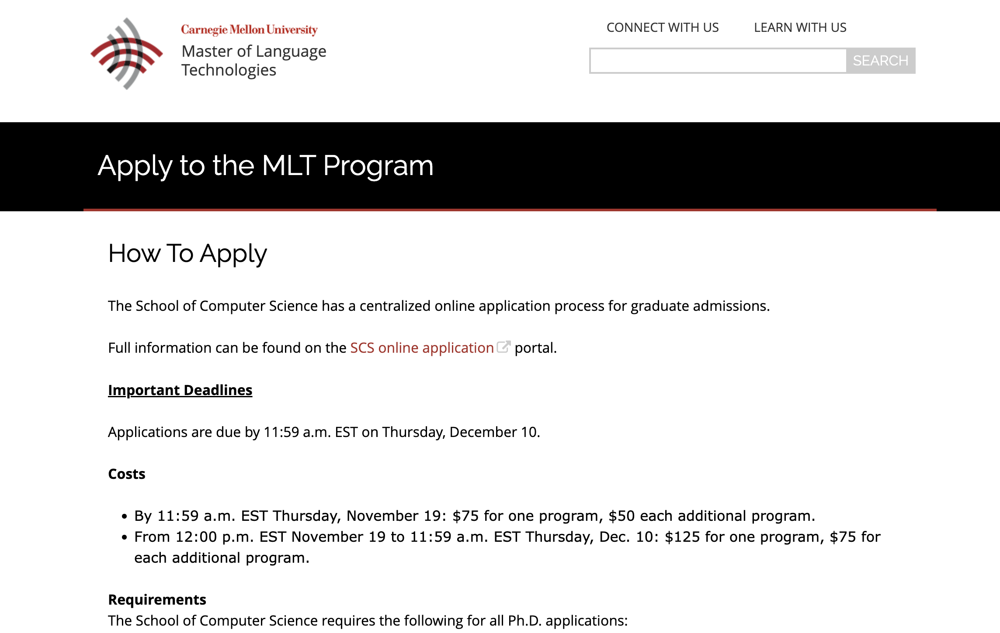
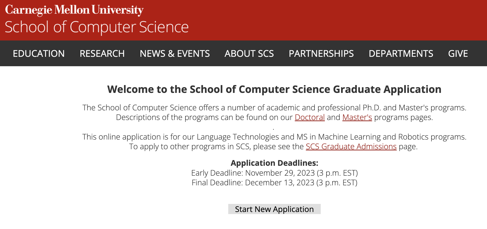
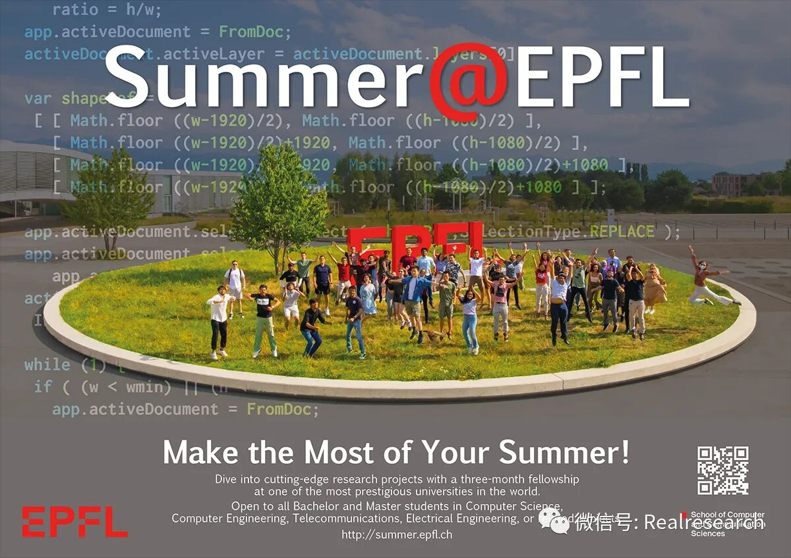

# 24fall 申请记录

写于 2024 年 3 月底，结果差不多出了，根据结果反思下在申请路程中做得对与不对的地方，并总结一些有用资源，希望可以帮到和我一样纯 DIY 申请的同学。

## master 选校

master 选项目主要经历了“添加心愿单”+“筛选”两个流程。

“添加心愿单”一步主要参照 zju 内部的飞跃手册 + [OpenCSApp](https://opencs.app/) + [GlobalCS](https://global-cs-application.github.io/) + 印象（e.g. 学长学姐，1p3a）等，先列出大约三五十个合适的项目。

“筛选”一步中再考虑各种限制条件（比如我的：学费高/就业导向的/不安全的/强制语言的不申），以及所有申到也不想去的那种保底项目也无需申请。
学费可以参照的资料比如 [Compare cost of living between cities](https://www.expatistan.com/cost-of-living) 和各个项目官方报的数目。

## PhD 选导

我首先靠跟组里同行认识的学长学姐交流，被推荐了一些当年正在招生的优秀 prof。此外自己主要参考了 [CSrankings](https://csrankings.org/)，挨个打开 Google Scholar 去读文章。也有发挥我的社牛属性去 X(twitter) 上把大家都关注然后刷文章这样做。经常刷 Arxiv 也是好习惯，可惜我还没养成。这些都有利于眼熟教授，一段时间后就可形成自己的选择。

另外选学校时如需参考 Stipend：[CSStipendRankings](https://csstipendrankings.org)。

最终 master + PhD 我一共申请了似乎是 14 个（含 3 个免费）。这个数目因人而异，主要看与推荐人沟通。身边也有朋友申到 50 个的，惊人但是尊重理解。

## 语言成绩

如果申请 PhD，那么大家的经验来看过线就够，不太会严卡，重点无需在语言成绩。

master 则应该是语言成绩越高越好了，尤其如果绩点 below average，那么语言确实需要考高一些。

以及我在申请季的几个月里一直没能打开 GRE 的官网（注意不是密码不正确，密码通过发邮件就能找回来了，是登录后跳转只能到 error 页面），换网换设备换🪜都还是一直刷新不出来，导致考了也没法查分，没法多添加送分。因为主要目标还是申 PhD 于是最后就不再挣扎了。GRE 官网是经常抽风的，看到身边一些 master 申请者会选择在大三就把 GRE 考出来，建议也像他们一样提前准备，如果也登陆不进去，多求助求助身边的人借设备试试，最好提前准备，避免到申请季发现影响送分。

下面记录一些热门项目-specific 的信息，注意可能变化

| 项目 | 要求 | 送分 |
| -- | -- | -- |
| CMU | T 必须，G 要求不同，参照。官网没有写具体分数要求，但是主观感觉申请人一般会有105/320+，由于申请人数巨大但每个项目只录 200 人左右，不交应该是减分项，建议刷高交掉 | 必须送分 |
| Umich Meng ECE | TG 都需要 | 需要送分，Code = 1839 |
| Uchi MPCS | GRE 的 q > 85%，该分位数可以考完后在 GRE 官网给的报告查看。v 没有要求，但是送分时会一并提交上去。| 都需要送分，Code = 1832 |
| UW CLMS | G 好像是 optional | 必须送分，Code = 4854 |
| USC | G optional | 不用送分，群里说送了不会看，Code = 4852|
| UCSD | G optional | 录取前不用送分，据说不会看，Code = 4836 |

送分 Code 还有一些帖子总结过更全的（可自行搜索），TG 都是用的是同一个送分 Code，以及 GRE 在考场里那次免费送分机会不用背送分 Code，在考场里也可以按校名搜索添加的。

## 推荐信

**推荐信如何被审核**：据说一般在招生官手里，推荐信是与申请者的其它材料一起拼成一长份多页 PDF 一起被审核的，几份推荐信前后并列。所以关于“风格明显不明显”“强度明显不明显”“会审文件信息”等问题可以想象一下审材料的这个场景，从这个角度来考虑。

**关于找多位推荐人**：大约 12.2 号看到 PhD 申请群里有人说，其实不要找 3 个推荐人就结束，最好提前找 4 到 5 个，因为多交没有关系，大部分学校都有添加多个推荐人的选项（我的选校里只有loo和umich上限三个），但是经常有推荐人忙忘了最后没交的情况。再问另一个群，得知如果是 US PhD，不会因为有一个推荐人忘了交拒你，但是大多 master 3 封交不齐就无法开始审材料，可能因此一直留在池子里，或者可能因此默拒。也有听说如果本该交 3 封交了 4 封，可能因此降低其中最重要的那封的效力，这点如果收到 >3 封推荐信其实可以通过 exclude 一份来解决，经验来看点 exclude 时推荐人应该不会收到通知。

**同一学校可以共用推荐信吗**: 一般不能。我申请的学校中可以的有

- Uchi 的 master 和 PhD
- Rice 的 master 和 PhD
- CMU 同申请系统之间的不同项目。比如 MSCS 和 CS PhD 内部共享，MLT 所在的那一大串的 AI 项目内部共享，两个系统之间不共享。
- UCSD 同学院的 ms 和 PhD 之间不能共享推荐信，据说 CS 和 CE 的 master 之间是互通的，CS/CE 和 GIS master 之间则不互通。
- Umich 目前只知道至少 ms 和 meng 之间不能共享推荐信。
- 哥大据群友说 cs ce ee 的 master 也是共用的。
- NEU 申请第一个后，附带的两个免费项目推荐信与第一个共享。
  
**推荐信系统不大智能的地方**:

- Umich 推荐人一共给定了 3 个空，如果推荐人填错了可以更改推荐人，更改后新的推荐人会收到邮件，但在你的申请里还是显示原来推荐人。
- Waterloo 的推荐信在第一步提交后 1-3 天内向推荐人发出，申请人不可决定，也不可以决定补发的时机。我的推荐人最快收到的是提交后 1 天左右，比我收到 Quest 账号的那封邮件还稍快半天左右。招生官告诉我之后在 ddl 前 14 天和 7 天还会各自动发一次催信。邮件问招生官补发额外的催信好像一般会被拒绝。

**听说过查 IP/MAC 地址的**: 目前大茅和哥大有见过 DP 收到学校邮件说查到信是自己发的。据此看来是不是藤校严一些。IP/MAC addr 如果查应该是额外查的，不是审材料的招生官负责查。

## 套瓷

一开始看到的消息是套到瓷才能申请，后来看到 [n+e's blog](https://trinkle23897.github.io/posts/application) 知道也不一定，先投了再套也可以，有些教授特别忙，可能担心有些学生聊了也没投，可能倾向学生确实投了再聊，或者等到他们自己从池子里捞人的时间线再聊。也可以参考强 prof 和强 committee 学校的一些名单（目前看到一个 [CS PhD强committee&强professor List(仅供参考)](https://zhuanlan.zhihu.com/p/128037373) 不过不一定很准，印象中里面说是强 committee 的一些也有与 prof 聊好就录了的 DP）。

double 的群里还有个朋友做了个匿名 google docs 供群友分享拿到面试的大致时间段，共享各学校面试发到什么进度了，可惜该表格不希望被外传。以后的申请群里大家也可以自发创建一个。

## 网申

寻找网申页面的通用做法一般是搜索引擎搜索 `学校和 program 名字` + `application`，结果前几条中一般就含正确的申请界面。网申内容感觉还是需要自己填，不要找代填，信息很多，非本人不熟悉太容易填错了。

下面记录一些 program-specific 的坑点。

**CMU**: 如果直接搜索 MLT application 出现的以下页面及申请链接是找不到MLT项目的

{ width="50%" }

[Application Management (cmu.edu)](https://admissions.scs.cmu.edu/portal/apply_gr) 这个页面和以下截图是正确的，同理mscv和msaii什么的项目也在这里申请。

{ width="50%" }

mscs 的 video essay 是提前录好了上传到 youtube 这种的，可以自己随意录多次，但我估计不要拼接痕迹太重，一口气说下来最好。内容我记得没有限制，随意设计自我介绍，据说主要是为了看申请人性格、口语、表达能力之类的潜在特点。

在细分的那几个 ai 项目的 video earry 是限 3 次机会，每次随机问题，限时准备，限时说。我看到的网上的帖子说好像 miis ini ece（记不住这几个项目名字，总之类似）是 30s 准备，180s 说，问的问题大类有：你队友怎么评价你，你收到的队友的一条负面评价是，你怎么领导 project，一个成功的 project 对你来说是怎样的，你喜欢什么沟通模式，对你来说什么是很难做的决定，你遇到挫折了会怎么样...这种很跟 course project 和合作有关的。

但是我在 mlt 里打开遇到的是 10s 准备，210s 说，遇到的两个问题供参考:

- 讲讲为什么选我们项目
- 你的研究兴趣都有什么
  
这样很研究导向的问题，一般都来自 SoP。

**UWaterloo**: 申请分为两个阶段，第一个阶段里交掉才能在第二个阶段上传 cv 文书 语言成绩等东西，第二阶段的链接会在第一阶段后 2-4 天收到。申请费在第一阶段交。推荐人在第一阶段添加，邮件随着第一阶段提交被发出。第一个阶段一定要比 ddl 提前两三天交。且 loo 的系统好像维护比较频繁，可以多预留一些时间。

**UT-Austin**: 同申请分为两个阶段，第一个阶段付款，审核 1-3 天后才能开始第二个阶段（含添加推荐人等）。第一阶段提交一定要比 ddl 早两三天。

**Umich**：网申系统一开始四五个页面要顺序填完（包括添加推荐人的部分），后面的页面才能跳着填。

## 文书

我写文书主要参照的资料有 [CS-SOP](https://cs-sop.org/), [CMU sop guideline](https://drive.google.com/file/d/1vksD1zYwsuRU4Zy_mYDWYCkdnofBjmtW/view), 和两三位学长学姐和 peer 的修改意见。

**CV** 我认为一般大家做出来的都没问题，少量值得 comment 的一些点有：

- 一般不用放照片，照片在个人主页即可。
- 选择的相关课程的优先级：分数好 > 相关性高
- 经历/pub/project 三项里，选择自己最丰富最想展现的放在前面，不太丰富的放在后面。
- 每条经历，可按照 `(1) 负责什么 (2) 遇到了什么问题 (3) 自己提出了什么方法来解决 (4) 达到了怎样的量化的结果` 的公式来分为三四个小点写。这样大致保证了多条经历的格式整齐，且比较明确自己的贡献，观感上会清晰些。
- 学术 CV （PhD，研究 master）可不加爱好/社团活动等。
- 有部分项目要求 CV 有固定格式，比如记得 Umich 要求带有 Umich 字样，部分项目要求把申请 ID 写进 CV 等，注意阅读网申页面的要求。

**SOP**

SOP 可以理解为关于自己学术经历和计划的一份文书。经验来看如果一些学校只要求 PS 不要求 SOP，那么 PS 应当当作一个格式不那么严格的 SOP 来写。

所有项目的文书加起来大约生产了近 20 份，其中如果内容相似的合并为同一份，那大概也有六七份完全不同的。一个有点玄学的感觉是我专门为其写了一份新文书的项目，PhD 导师就发了面试，master 就发了 offer，而从别的项目改改而来的那些一定没有发面试/拿 offer。有可能因果关系有“我感觉不会中/不是特别合适” -> “因此更加没有认真准备文书” -> “因此当然拿不到”这一层。

一般是自己拟好草稿后交给学长学姐或 peer 来改，后来赶 ddl 大家都比较忙，有些就自己写好直接交了。倒是觉得自己写完有没有找人 review 这点对结果的影响没有很大，PhD 导师们也表示看重的更多是方向 match 不 match，信息表达正确到位是最重要的，语言美化倒在其次。且一些学校（Waterloo, UW, Uchi）文书也会限制 500/1000 words，这样短的限制里确实表达不了多少，也说明传达信息是第一位的。自己写也有一套比较高效的流程，灵感来源于大一上 EW1 的魔鬼外教老师讲的 shitty first draft 概念：第一稿难下手常常是因为想要同时兼顾信息和表达，那么把两件事拆开，第一稿先一口气写出个表达信息全面正确但用语非常 shitty 的文章，第二稿只顾优化表达，那就不会卡壳。我写的流程也大致是这样，先把所有想表达的信息吐出来，形成一篇至少长得像文章的文章（但甚至不会顾及用什么语，经常一半英语一半中文），然后一段一段输入 ChatGPT 请它 "please refine this paragraph from a {文体} for me: {paragraph}"，再一句一句比对 ChatGPT 输出结果与自己的写作，手动把一个觉得更好的结果敲回到文章中（这里我个人认为过一遍脑子后亲自决定怎么改是比直接复制更高效更明智的方法，因为 ChatGPT 对于申请文书类的文体常常有一套特别固定且官方的用词，使其不太合适且太容易识别出是机器写的）。最后把这遍自己改过的写作过一遍 grammarly 检查语法，简单检查后就基本可以定稿了。

此外还有一点是，我个人认为在审文书时每份文书 5-10 分钟，可能所有人能一眼看到的是 (1) 小标题 (2) 加粗的关键词，最后才会细看大量普通文字。一个例子是我上次参加一门课的 group tutorial 时，当时小组成员合写了一份 rp，其中我写的是最晦涩的 lit review，即专业术语密度最高还句子最长，但是我给每个分主题加了小标题，其它同学写的部分没有加。老师在与我们谈话的间隙瞄了几眼我们的文件，短短的时间里就只看进去了 lit review 的小标题，点评了一下这部分。因此做清晰的分段和小标题很重要（这里真的有点像设计四原则，对比/聚合），尤其是时间精力不够时，其中的细节内容说不定不用抠太细，可能招生官和 prof 在短暂 review 的时间里捕捉到的信息也只有少量最显眼的。因此我的每份文书都做了加粗 \noindent 这样的小标题来引导招生官，不知道合不合规，但是应该也没有规矩，且 CS-SOP 上不少文书也是这样加小标题写的，我认为这样比较有利所以就这样做好了。

附自己阅读 CS-SOP 后写自己的 SOP 前，给自己写的结构指导

- 第一段：xxx 是很重要的，我一直对 xxx 感兴趣，我选择在 x 校读 phd is naturally a continuation of my previous interests and experiences。具体而言，我的研究兴趣为：
         ( 此处可以有小标题和一句话介绍
         \1. AAA aaaa
         \2. BBB bbbb
         \3. CCC cccc
            )

- 第二段：AAA （小标题可以写完一整段后最后再起）
       - 一个方向有多重要简介 * 1 句
       - （自己过去课程项目，如果真的很重要的话吧）* 1 句
       - 自己过去研究 * 1-3 项
       - 未来研究 * 1-2 项
       - 在这方面希望达到的目标 * 1 句

- 第三段：BBB 同上
- 第四段：CCC 同上上
- 第五段：Moving forward，我毕业后的职业目标是什么，学术目标是什么
- 第六段：why \[program name\] and why \[school name\]，如果是学术项目就多讲些老师的研究有多 match，如果是 master 可以说说学校资源好，设置的课程对自己有帮助的有哪些，如何有利于自己的计划。如果是强 prof 制的项目，据说这里提到的导师多一些好，因为可能有的老师搜到文书中提到自己才会去阅读文书。注意部分明确写着不做科研、不让学生找导师的项目不要提到学术理想和 match 的导师，注意阅读具体项目介绍。
- References：自己的文章优先，别人文章也可

我在写文书之前，一直认为我的过去研究经历与我未来的目标方向不相似，但是最后 push 自己必须去寻找一个平衡点，寻找能把它们都概括住的两三个小标题。这两三个小标题的选择首先要服务于未来方向，然后因为过去的每个项目不可能只有一个属性/领域，可以选择能够服务于未来方向的方面来支撑这些小标题，用“我受到了 xx 方面的启发”“在做该项目的时候一直在思考某方面不足”之类的话连接起来。最后的感悟是写作文书的过程（描述自己的过程）即认识和定义自己过去的研究的过程，感觉写完后我对之前研究的认识也确实变成了连贯的一个整体，且产生了一些对未来研究的启发。

以及部分项目也会在网申页面给出文书写作指导（e.g. UCSD, CMU），可留意阅读这些指导，按具体项目的来增删改。

**PS** 

如上文提到，如果部分学校只要求一份 PS，那么应当是需要当作 SOP 来写学术和职业内容的。我是这样规划结构的：

- 第一段：一些 hook，讲一点对自己总结性的话/tattoo，或者干脆直接从“我本科开始对 xxx 感兴趣，于是上了很多课做了很多研究”平实地开始
- 第二段：一般一两句话带过课程，有特别出色的 score 或 coursework 可以在这里说
- 第三到五（或四）段：每段一个经历，可以总分总写，找到一个这段经历最想突出的特点/品质，然后围绕着说
- 第六段：moving forward 讲以后的规划
- 第七段：why \[program name\] and why \[school name\]
- 第八九段：如果学校有特殊的 diversity, 奖学金, gre clarification 之类的可以在这里写
- References

如果 PS 和 SOP 同时需要，那么 PS 用来讲故事比较好。我没有设计一份通用的故事，基本是看项目要求、录取偏好然后写对应的故事，比如 NEU MSCS 我写了一篇“自己如何一直喜欢 cs 并一点一点做开源项目”的故事，Rice 让写一个克服困难的故事，我就写我受到了一些专业歧视但还是努力去参与 CS 课程和社群的经历。这两段都是比较个人化，有点 emotional，但是主题又跟个人品质和学业有关的，根据面试或 offer 等途径的反馈来看感觉招生官还比较看好。

**成绩单**

把成绩单列为文书是因为我交了一份非常不寻常的成绩单，在成绩单前面附了 4 页 cover letter 论述我这几年通勤玉泉大概花费总时间多少，我的总学分比别人多多少，我申请后毕业前预计完成的课程还有哪些，总之确实上课的工作量大，希望招生官也能考虑这个因素等。也不知道合不合规，但这些东西确实不知道哪里去写。目前还没有直接或间接的反馈能告诉我这样做对不对或好不好。

## 暑研

对于暑研一个比较简单的 comment 是如果想申北美 PhD 就直接去陶瓷北美，不要在意“北美 rank 不好的学校是不是不如别的地区 rank 好的学校”，因为地区内圈子的老师还是会比地区外熟一些，且部分老师暑研的风格是把好学生推向更好的老师以建立学术 connection。以及虽然在北美 onsite 研究确实对社交有利，但条件很难具备，因为签证办理难度大，对教授来说常常投入大于回报，学生适应成本也高，不一定能有利于效率，所以如果有 prof 跟我说不愿为我办签证我是能理解的。online 效力也不低的。

比较固定常年开放的几个暑研

- [MPI](https://www.mpi-sws.org/research-careers/)：记得前一年 11 月即截止
- [AllenAI Predoctoral Young Inverstigator](https://boards.greenhouse.io/thealleninstitute/jobs/5358681)：不知道是什么惊天大 bar，身边人暂时没有去的，目测很难进，不知道是不是得在北美当地才行。
- [prof. Diyi Yang](https://www.notion.so/ruoxining/Application-e735c57a86504e0c9cf0542727700e1c?pvs=4#2ab67ef795034c5ead264e391c73d3e2)
- [Yale Bioinfo](https://docs.google.com/forms/d/e/1FAIpQLSeK9cyQCc71OII3lwsE5CMJXNhwfXbcE0cF7EzneJCkoxcKqw/viewform)：招 zju 暑研很多，据说猛卷易拿 return
- 加拿大 Mitacs，好像考核比较严格
- epfl
   
   { width="50%" }

- 其它很多老师主页可能也有常年开放渠道

## 接 offer 的考虑和致谢

（先 TODO 了，暂时有点恍惚，在考虑“自己有没有对得起所有人对我的帮助”“自己能否胜任这么优秀的老师可能带给我的挑战”等问题 😭）
